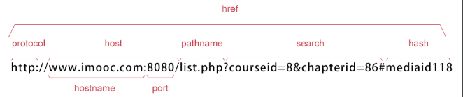
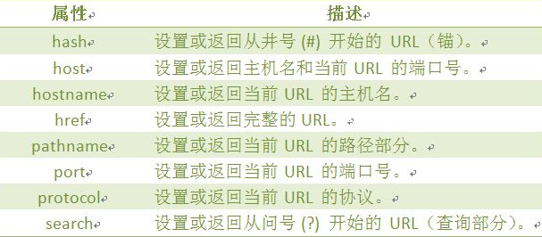
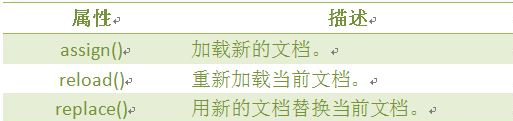
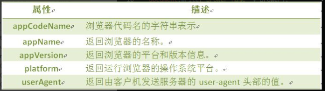
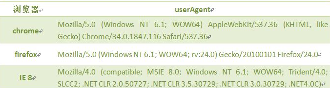
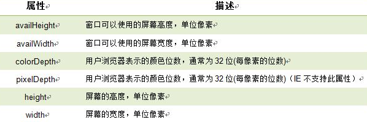

# Javascript

## 1.浏览器对象

### 1. 1 location对象







### 1.2 navigator



userAgent



```javascript
function validB(){ 
  var u_agent = navigator.userAgent; 
  var B_name="Failed to identify the browser"; 
  if(u_agent.indexOf("Firefox")>-1){ 
      B_name="Firefox"; 
  }else if(u_agent.indexOf("Chrome")>-1){ 
      B_name="Chrome"; 
  }else if(u_agent.indexOf("MSIE")>-1&&u_agent.indexOf("Trident")>-1){ 
      B_name="IE(8-10)";  
  }
    document.write("B_name:"+B_name+"<br>");
    document.write("u_agent:"+u_agent+"<br>"); 
} 
```

### 1.3 screen对象

window.screen

