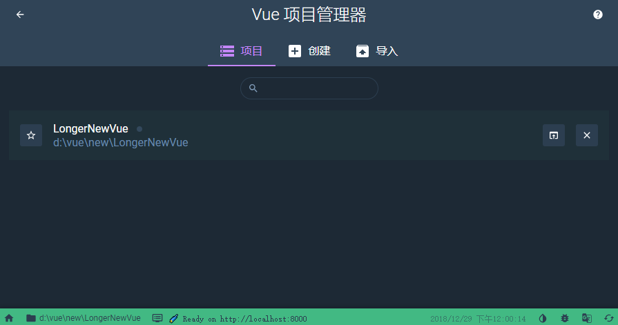
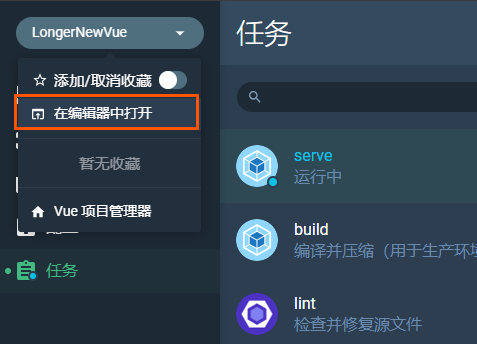

# VUE-BASIC
## 1.basic
### 1.1 `el`--选择器
### 1.2 `### --实例属性与方法
```html
<div id="vue_det">
    <h1>site : {{site}}</h1>
    <h1>url : {{url}}</h1>
    <h1>Alexa : {{alexa}}</h1>
</div>
<script type="text/javascript">
// 我们的数据对象
var data = { site: "菜鸟教程", url: "www.runoob.com", alexa: 10000}
var vm = new Vue({
    el: '#vue_det',
    data: data
})
// true
document.write(vm.$data === data) 
// true
document.write("<br>") 
// true
document.write(vm.$el === document.getElementById('vue_det')) 
</script>
```
### 1.3 `v-`指令
1. v-html:输出html代码
2. v-if:是否插入
3. v-bind:使用属性中的值(缩写`:`)
4. v-on:监听DOM事件(缩写`@`)
5. .修饰符:如`v-on:submit.prevent="onSubmit"`调用event.preventDefault()
6. v-model:双向绑定.用来在 input、select、text、checkbox、radio 等表单控件元素上创建双向数据绑定，根据表单上的值，自动更新绑定的元素的值。
7. v-show:安装条件展示元素

```html
<style>
.class1{
  background: #444;
  color: #eee;
}
</style>
<div id="app">
    <p v-if="seen"></p>
    <div v-html="message"></div>
    <label for="r1">update color</label>
    <input type="checkbox" v-mosdel="class1" id="r1>
    <!-- 如果class1的值为true使用class1的样式 -->
    <div v-bind:class="{'class1':class1}">
        v-bind:class 指令
    </div>
    <div>
        <p>v-model双向绑定</p>
        <p>{{msg}}</p>
        <input v-model="msg">
        <button v-on:click="reverseMsg">反转</button>
    </div>
    <h1 v-show="seen">Hello!</h1>
</div>
<script>
new Vue({
    el:'#app',
    data:{
        seen:true,
        message:'<h1>Longer\' World</h1>',
        msg:'super',
        class1:false
    },
    method:{
        reverseMsg:function(){
            this.msg=this.msg.split('').reverse().join('')
        }
    }
})
</script>
```
> Vue与JavaScript均可以使用
```html
<div id="app">
	{{5+5}}<br>
	{{ ok ? 'YES' : 'NO' }}<br>
	{{ message.split('').reverse().join('') }}
	<div v-bind:id="'list-' + id">菜鸟教程</div>
</div>
	
<script>
new Vue({
  el: '#app',
  data: {
	ok: true,
    message: 'RUNOOB',
	id : 1
	}
})
</script>
```
### 1.4 过滤器`|`

#### 1.4.1 语法
> {参数|过滤原则}
```html
<div id="app">
<!-- 将msg转化为大写 -->
{{msg|capitalize}}
</div>

<script>
new Vue({
    el:'#app'
    data:{
        msg:'longer'
    }
    //大写
    capitalize:function(value){
        if(!value) return ''
        value=value.toString
        return value.chatAt(0).toUpperCase+value.slice(1)
    }
})
    
</script>
```
#### 1.4.2 过滤器可以串联
> {{msg|filterA|filterB}}
#### 1.4.3 过滤器可以传参
> {{msg|filterA('arg1',arg2)}}

### 1.5 条件判断
#### v-if的另一种用法
在上面已经看到了v-if的一种用法,下面还有一种用法:
字符串模板中:
```html
{{#if ok}}
    <p>longer</p>
{{/if}}
```
#### v-else以及v-else-if
```html
<div v-if="Math.random()>0.5">
    hello
</div>
<div v-else-if="Math.random()>0.8">
    longer
</div>
<div v-else>
    world
</div>
```
### 1.6 `v-for`循环
#### 1.6.1 数组循环
```html
<div id="app">
    <ol>
        <li v-for="site in sites">
            {{site.name}}
        </li>
    </l>
    <!-- 使用模板 -->
    <ul>
        <template v-for="site in sites">
            <li>{{site.name}}</li>
            <li>------</li>
        </template>
    </ul>
</div>

<script>
new Vue({
    el:"#app",
    data:{
        sites:[
            {name:'google'},
            {name:'baidu'}
        ]
    }
})
</script>
```
#### 1.6.2 使用属性
```html
<div id="app">
    <ol>
    <!-- 使用value属性 -->
        <li v-for="value in object">
            {{value}}
        </li>
    </l>
</div>

<script>
new Vue({
    el:"#app",
    data:{
        object:{
            name:'google',
            address:'Shanghai'
        }
    }
})
</script>
```
#### 1.6.3 多参数 `{key,value}`,`{key,value,index}`
```html
<!-- 两个参数 -->
<li v-for="{key,value} in object">
    {{key}}:{{value}}
</li>
<!-- 三个参数 -->
<li v-for="{key,value,index} in object">
   {{index}}.{{key}}:{{value}}
</li>
```
#### 1.6.4 迭代 整数
```html
 <li v-for="n in 10">
     {{ n }}
</li>
```
### 1.7 计算属性
#### 1.7.1 `computed`与`methods`
> 1. `computed`与`methods`作用相同

> 2. `computed`依赖于缓存,只有相关依赖发生变化时才会重新取值,所以性能更好

>  3. `methods` 重新渲染时,函数总会重新调用

```html
<script>
new Vue({
    el:"#app",
    data:{
        msg:'hello longer'
    }
    computed:{
        reverseMsg:function(){
            return this.msg.split('').reverse().join('')
        }
    }  
})
</script>
```

#### 1.7.2 `computed`默认只有`getter`,没有`setter`(但可以自定义)

```html
<script>
    new Vue({
        el:"#app",
        data:{
            msg:'hello longer'
        }
        computed:{
            Longer{
                get:function(){
                    return this.msg.split('').reverse().join('')
                }
                set:function(newValue){
                    var names=newValue.split(' ')
                    this.msg=names[0]
                }    
            }  
        }  
    })
    //调用setter
    vm.Longer='longer\' world coming!';
    domcument.wirte('msg:'+vm.msg);
</script>

```

### 1.8 `watch`--监听属性

```html
<div id="app">
    <p style="font-size:25px">
        计数器:{{counter}}
    </p>
    <button @click="counter++" style="font-size:25px">
        come on!
    </button>
</div>
<script>
    var vm=new Vue({
        el:'#app',
        data:{
            counter:1
        }
    });
    //oval原来的值
    //nval现在的值
    vm.$watch('watch',function(nval,oval){
        alert('计数器的变化: '+oval +'变为'+nval+'!');
    });
</script>

```

#### 1.8.1 实例

```html
<div id="app">
    <input style="font-size:25px" v-model="kilometers">
        {{kilometers}}千米
    </input>
    <input style="font-size:25px" v-model="meters">
        {{meters}}米
    </input>
    <p id="info"></p>
</div>
<script>
    var vm=new Vue({
        el:'#app',
        data:{
            kilometers:0,
            meters:0
        },
        watch{
            kilometers:function(val){
                this.kilometers=val
                this.meters=val*1000;
            },
            meters:function(val){
                this.meters=val;
                this.kilometers=val/1000;
            }
        }
    });
    //oval原来的值
    //nval现在的值
    vm.$watch('kilometers',function(nval,oval){
        domcument.getElementById("info").innerHTML='kilometers的变化: '+oval +'变为'+nval+'!';
    });
</script>

```

### 1.9 样式绑定
#### 1.9.1 属性绑定
> 有两种方式,传入属性(可包括多个)或对象

```html
  <div v-bind:class="{active:isActive,'text-danger':false}"></div>
  <div v-bind:class="classObject"></div>
```

```html
<style>
.base {
  width: 100px;
  height: 100px;
}

.active {
  background: green;
}

.text-danger {
  background: red;
}
</style>
</head>
<body>
<div id="app">
  <div v-bind:class="{active:isActive}"></div>
  <div v-bind:class="classObject"></div>
</div>
<script>

new Vue({
  el: '#app',
  data: {
    isActive: true,
    error: {
      value: true,
      type: 'fatal'
    }
  },
  computed: {
    classObject: function () {
        //返回属性
      return {
        base: true,
        active: this.isActive && this.error.value,
        //text-danger会覆盖active类的颜色
        'text-danger': !this.error.value && this.error.type === 'fatal'
      }
    }
  }
})
</script>
```

#### 1.9.2 数据语法
```html
<div id="app">
<!-- 等同于  class="active text-danger" -->
	<div v-bind:class="[activeClass, errorClass]"></div>
</div>

<script>
new Vue({
  el: '#app',
  data: {
    activeClass: 'active',
    errorClass: 'text-danger'
  }
})
</script>
```

#### 1.9.3 内联样式

```html
<div id="app">
    <div v-bind:style="{ color: activeColor, fontSize: fontSize + 'px' }">
        菜鸟教程
    </div>
    <!-- 直接绑定一个样式对象 -->
    <div v-bind:style="styleObject">菜鸟教程</div>
    <!-- 绑定多个对象 -->
    <div v-bind:style="[baseStyles, overridingStyles]">菜鸟教程</div>
</div>
​<script>
    new Vue({
    el: '#app',
    data: {
        activeColor: 'green',
        fontSize: 30,
        styleObject: {
        color: 'green',
        fontSize: '30px'
        },
        baseStyles: {
        color: 'green',
        fontSize: '30px'
        },
        overridingStyles: {
        'font-weight': 'bold'
        }
    }
    })
</script>

```

### 1.10 `v-on`--事件处理器

### 1.11 `$mount` 挂载

1. 参数
    - {Element|string}[elementOrSelector]
    - {boolean}[hydrating]
2. 返回值--实力本身
3. 实例

```javascript
var MyComponent=Vue.extend({
    template:'<div>hello</div>'
})

//用法一    创建并挂载到#app  (会替换#app)
new MyComponent().$.mount('#app')
//同上
new MyComponent({el:'#app'})

```


## 2. vue进阶

### 2.1 cli安装

`npm install -g vue-cli`

### 2.2 创建项目
1. 方式一
  打开指定目录
  `vue init webpack myProject`

2. 方式二

   `vue ui`打开创建页面

   

   根据提示,就可以创建项目了.

   创建完之后的页面.可以运行,编译等


选择在编辑器打开项目




### 运行,编译

