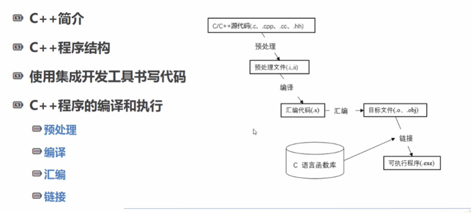
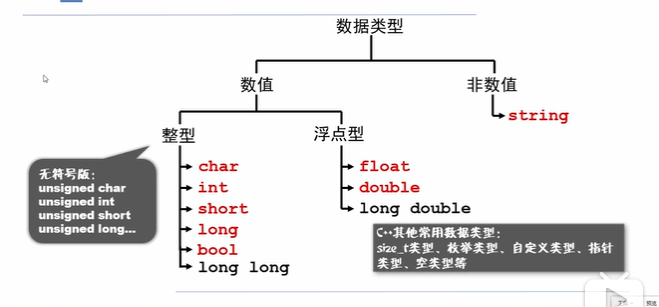

# C++ Basic
## 1.编译执行

## 2.常量,变量
### 2.1 常量定义方式
1.#define

    `#define`使用的时候不需要使用`=`和`;`结尾

```c++
#define MAX_SIZE 9
``` 

2.const
```c++
#include <iostream>
using namespace std;
#define LENGTH 9;
const WIDTH 8;
int main(){
    int area;
    area=LENGTH*WIDTH;
    cout<<"area:"<<area<<endl;
    return 0;
}

```

### 变量的类型


### 小数精度定义

定义小数精度,类型
`cout<<fixed<<setprecision(2);`

```c++
#include <iostream>
#include <cmath>
#include <iomanip> //设置小数展示形式的
using namespace std;
int main(){
    cout<<fixed<<setprecision(2);
    double double_num=100.0/1.0;
    cout<<double_num<<endl;
    return 0;
}
```

注意点
    1. 精度setprecision(2),设置小数位数
    2. 一定开始定义,下面所有的输出格式都是如此


## 2.2 自定义类型别名-`typedef`
```c++
#include <iostream>
using namespace std;
int main(){
    typedef unsigned int my_int;
    my_int a=1;
    cout<<"a:"<<a<<endl;
    return 0;
}
```

循环

1. while
```c++
a=10;
while(a>0>){
    cout<<"a:"<<a<<endl;
}
```
2. do...while

```c++
do{
    statement(s);
}while(condition);
```

3. for

```c++
for(init;condition;increment){
    statement(s);
}
```

第二种for循环...foreach
```c++
int my_array[5]={1,2,3,4,5};
for(int &x:my_array){

}

```


cin
```c++
#include 
```


```c++

#include <algorithm>
#include <vector>
//////////////////////////////////////////////
int nArray[] = {0, 1, 2, 3, 4, 5};
std::vector<int> vecNum(nArray, nArray + 6);
CString strText;
// 第一种用法：最原始的语法(用下标)
for (size_t i = 0; i < vecNum.size(); ++i)
{
    strText.Format("%d", nArray[i]);
    AfxMessageBox(strText);
}

// 第二种用法：最原始的语法(用迭代器)
for (auto it = vecNum.begin(); it != vecNum.end(); ++it)
{
    strText.Format("%d", *it);
    AfxMessageBox(strText);
}

// 第三种用法：简化数组遍历语法(从vs2008开始支持)
for each(auto item in vecNum)
{
    strText.Format("%d", item);
    AfxMessageBox(strText);
}

// 第四种用法：STL函数
std::for_each(vecNum.begin(), vecNum.end(), [](int item){
                                                   CString strText;
                                               strText.Format("%d", item);
                                       AfxMessageBox(strText);
                                                    });

// 第五种用法：C++11新增加的(VS2012支持)
for(auto item : vecNum)
{
     strText.Format("%d", item);
     AfxMessageBox(strText);
}
```

## 字符串