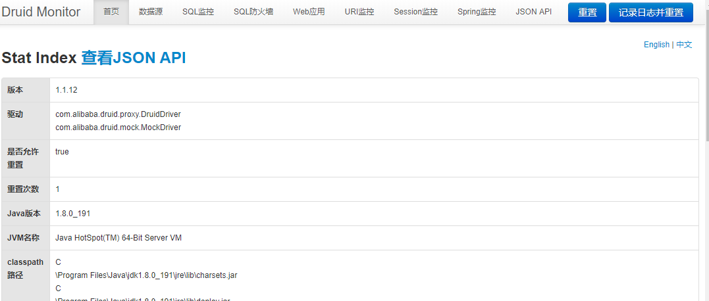

# Druid-springboot

## 1. 简介

1. 加载需要的依赖
2. 配置---定义与application.yml中
3. 创建DruidConfig,并加载属性配置
4. 设置过滤器
5. 设置视图
6. 访问登录页面

## 2. 加载依赖

- druid
- log4j

```xml
<!--druid-->
<dependency>
	<groupId>com.alibaba</groupId>
	<artifactId>druid</artifactId>
	<version>1.1.12</version>
</dependency>

<!--springboot本身自带的logging,先排除掉-->
<!-- Exclude Spring Boot's Default Logging -->
<dependency>
	<groupId>org.springframework.boot</groupId>
	<artifactId>spring-boot-starter</artifactId>
	<exclusions>
		<exclusion>
			<groupId>org.springframework.boot</groupId>
			<artifactId>spring-boot-starter-logging</artifactId>
		</exclusion>
	</exclusions>
</dependency>

<dependency>
	<groupId>log4j</groupId>
	<artifactId>log4j</artifactId>
	<version>1.2.17</version>
</dependency>
```

## 3. 定义相关的属性

```yml
 spring:
  datasource:
    type: com.alibaba.druid.pool.DruidDataSource
    # 下面这部分是自己配置的,在DruidConfig会配置
    druid:
      driver-class-name: com.mysql.jdbc.Driver
      url: jdbc\:mysql\://localhost\:3306/longer?useUnicode\=true&characterEncoding\=UTF-8&autoReconnect\=true
      username: root
      password: 123456
      # 初始化大小 最大 最小
      initialSize: 1
      minIdle: 1
      maxActive: 20
      # 配置获取连接等待超时的时间
      maxWait: 60000
      #: 配置间隔多久才进行一次检测   检测需要关闭的空闲连接   毫秒
      timeBetweenEvictionRunsMillis: 60000
      #: 配置一个连接在池中最小生存的时间  毫秒
      minEvictableIdleTimeMillis: 300000
      #: 打开PSCache  并且制定每个链接上的PSCode的大小
      poolPreparedStatements: true
      maxPoolPreparedStatementPerConnectionSize: 20
      filters: stat,wall,log4j
      connectionProperties: druid.stat.mergeSql=true;druid.stat.slowSqlMillis=5000
      # 合并多个DruidDataSource的监控数据
      useGlobalDataSourceStat: true

```

## 4. 创建DruidConfig

```java
package com.longer.demo.framework.druid;

import com.alibaba.druid.pool.DruidDataSource;
import org.springframework.boot.context.properties.ConfigurationProperties;
import org.springframework.boot.web.servlet.ServletComponentScan;
import org.springframework.context.annotation.Bean;
import org.springframework.context.annotation.Configuration;

import javax.sql.DataSource;

/**
 * @program: demo
 * @description:
 * @author: SunBiaoLong
 * @create: 2019-01-08 14:26
 **/
@Configuration
//用于扫描所有的servlet,filter,listener
@ServletComponentScan
public class DruidConfig {
	/**
	 * 在下面的连接中登录---登录信息配置在
	 * @see com.longer.demo.framework.druid.DruidStatViewServlet
	 * <a href="http://localhost:8090/longer/druid/login.html"/>
	 *
	 * @return
	 */
	@Bean
	@ConfigurationProperties(prefix="spring.datasource.druid")
	public DataSource druidDataSource(){
		return new DruidDataSource();
	}
}
```

## 5. 过滤器

```java
package com.longer.demo.framework.druid;

import com.alibaba.druid.support.http.WebStatFilter;

import javax.servlet.annotation.WebFilter;
import javax.servlet.annotation.WebInitParam;

/**
 * @program: demo
 * @description:
 * @author: SunBiaoLong
 * @create: 2019-01-08 14:30
 **/
@WebFilter(
		filterName = "druidWebStatFilter",
		urlPatterns = "/*",
		initParams = {
				//配置本过滤器放行的请求后缀
				@WebInitParam(name = "exclusion",value = "*.js,*.jpg,*.png,*.gif,*.ico,*.css,/druid/*")
		}

)
public class DruidFilter extends WebStatFilter{
}

```


## 6. 视图

```java
package com.longer.demo.framework.druid;

import com.alibaba.druid.support.http.StatViewServlet;

import javax.servlet.Servlet;
import javax.servlet.annotation.WebInitParam;
import javax.servlet.annotation.WebServlet;

/**
 * @program: demo
 * @description:
 * @author: SunBiaoLong
 * @create: 2019-01-08 14:33
 **/
@WebServlet(
		urlPatterns = "/druid/*",
		initParams = {
				@WebInitParam(name="allow",value="127.0.0.1"),
				@WebInitParam(name="loginUsername",value="longer"),
				@WebInitParam(name="loginPassword",value="123456"),
				// 允许HTML页面上的“Reset All”功能
				@WebInitParam(name="resetEnable",value="true")
		}
)
public class DruidStatViewServlet extends StatViewServlet implements Servlet {
	private static final long serialVersionUID = 1L;
}

```

## 7.登录

 http://localhost:8090/longer/druid/login.html

