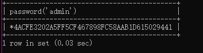
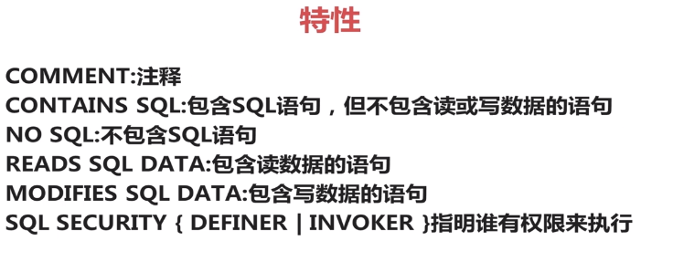

# MYSQL--BASIC
## 1. 内置函数
### 1.1 日期函数
https://www.cnblogs.com/ggjucheng/p/3352280.html
#### 1.1.1 sysdate()与now()
> now()是开始执行的时间

> sysdate()是实时的,动态的
#### 1.1.2 日期转换

1. 日期时间转换为字符串 
   - date_format(date,format) 
   - time_format(time,format)
2. 字符串转为日期
   - str_to_date(str,format)
### 1.2 其他函数及命令
show tables;
desc table;
show create table table_name;--查看创建表语句
show databases;
select database();--查询当前使用的数据库
select user();--当前的用户
select version();--mysql版本
DELIMITER //--修改定界符为//
mysql -uroot -p123456  ---mysql -u用户名 -p密码
exit;

### 1.3加密函数
> web页面使用MD5()

> 修改mysql当前用户和其他用户的密码使用password() 

#### 1.3.1 MD5--信息摘要算法
select md5("admin");


#### 1.3.2 PASSWORD()--密码算法
select password('admin');


#### 1.3.3 修改当前用户的密码
set password=password('longer');


## 2. 自定义函数
### 2.1 无参数函数
```sql
-- 定义函数
set names gbk;

CREATE FUNCTION f1() RETURNS VARCHAR(30)
RETURN DATE_FORMAT(NOW(),'%Y年%m月%d日 %H点:%i分:%s秒');

-- 调用函数
select f1();

```
### 2.2 有参数函数
```sql
create function f2(num1 smallint unsigned,num2 smallint unsigned)
returns float(10,2) unsigned
return (num1+num2)/2;
```
### 2.3 修改定界符
```sql
DELIMITER //--修改定界符为//
DELIMITER ;
```
### 2.4 复合结构函数
1. 多条语句,每个都需要 ; ,因此需要修改定界符
2. 多条语句,使用begin  end 构成一个聚合体

```sql
DELIMITER //
create function adduser(name varchar(20))
returns int unsigned
begin 
insert user(name) values(name);
return last_insert_id();
end
//

DELIMITER;--修改为;

```

## 3. 存储过程
### 3.1 简介



### 3.2 无参数过程函数创建和调用
```sql
create procedure sv() select version();
call sv;
call sv();
```
> 如果无参数,()可以省略

### 3.3 带参数过程函数创建
```sql
delimiter //
create procedure removeUserById(IN id int )
begin 
delete from user where id=id;
end
//
delimiter ;
call removeUserById(1);
```
> 问题:`where id=id`,id有不同的意义,但是mysql无法做出区分


### 3.4 修改存储过程及删除


目前修改存储过程,无法修改过多的内容
因此,先删除,再重新定义

```sql
--删除
drop procedure removeUserById;
-- 定义
delimiter //
create procedure removeUserById(IN userId int )
begin 
delete from user where id=userId;
end
//

delimiter ;

```

### 3.5 随机删除字段,返回剩余字段数
```sql
delimiter //
create procedure removeUserAndReturnUserNums(IN userId int, OUT userNums int unsigned)
begin 
delete from user where id=userId;
select count(id) from user into userNums;
end
//
delimiter ;
-- @num使用户变量
call removeUserAndReturnUserNums(5,@num);
--获取user里面的记录数
select @num;

```
### 3.6 用户变量
> 对用户所使用的客户端有效
```sql
set @var =7;--声明
/*使用select语句声明并赋值*/
select @age:=23;
```
### 3.7 创建多个out类型参数的存储过程
```sql
delimiter //
create procedure removeUserByAgeReturnInfos(IN userAge int, OUT deleteRowCount int,OUT infos int)
begin 
delete from user where age=userAge;
select row_count() into deleteRowCount;
select count(id) from user into infos;
end
delimiter ;

call removeUserByAgeReturnInfos(18,@row,@infos);
select @row,@infos;
```

### 3.8  row_count()
操作影响的行数
```sql
--同时插入多行
insert into user(name) values ('a'),('b'),('c');
select row_count();--结果为3
```

## 4. 存储引擎
- MyISAM
- InnoDB
- Memory
- CSV
- Archive


### 4.1 锁颗粒
#### 4.1.1 表锁
是一种开销最小的锁策略

#### 4.1.2 行锁
是一种开销最大的锁策略


### 4.2 事务
- 原子性 Atomicity
- 一致性 Conisitency
- 隔离性 Isolation
- 持久性 Durability
### 修改储存引擎
1. 修改配置文件
- default-storage-engine=engine
2. 在创建数据表的时候,设定引擎
- create table table_name(
    ...
)engine=engine;

3. 修改表结构
- alter table table_name engine=engine;

## mysql5.7复制