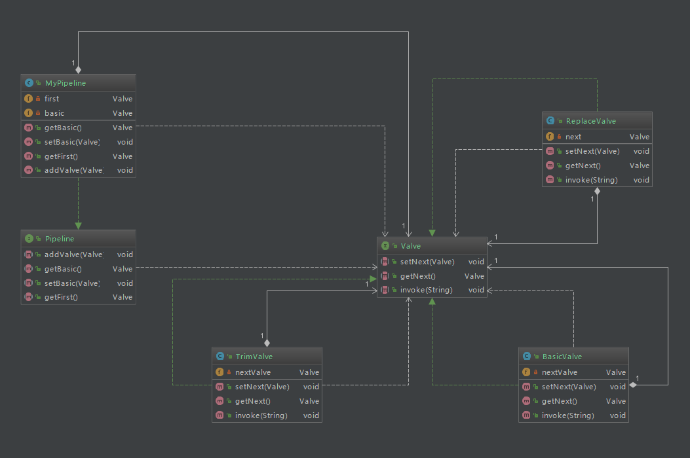

# Design
## 1. 装饰器模式
利用装饰器，会更容易扩展业务
装饰和实现分离，可以实现松耦合
### 1.1 优点及不足
优点：装饰类和被装饰类可以独立发展，不会相互耦合，装饰模式是继承的一个替代模式，装饰模式可以动态扩展一个实现类的功能。
缺点：多层装饰比较复杂。
.png)
### 1.2 使用场景
1. 扩展一个类的功能。 
2. 动态增加功能，动态撤销。
### 1.3 注意事项
可代替继承。

## 2 过滤器模式
.png)

## 3. 管道模式
### 3.1 简介
顾名思义，管道模式就像一条管道把多个对象连接起来，整体看起来就像若干个阀门嵌套在管道中，而处理逻辑就放在阀门上，如下图，需要处理的对象进入管道后，分别经过阀门一、阀门二、阀门三、阀门四，每个阀门都会对进入的对象进行一些逻辑处理，经过一层层的处理后从管道尾处理，此时的对象就是已完成处理的目标对象。


### 3.2 类图
既然管道模式这么有用，我们希望能在程序中适当地考虑使用，为了实现此模式需要多个对象协作，可参考如下类图，Valve接口定义了阀门的调用方法，由于阀门与阀门使用单链表结构连接所以需提供对next的操作，实现一个阀门对其进行扩展即可；Pipeline接口定义了管道操作阀门的方法，包括获取第一个阀门、获取基础阀门、添加阀门等方法，管道需对其扩展。


## 附录
### 1. Arrays.asList
> 原来此处的ArrayList是Arrays的一个实现了AbstractList的内部类，
> 并且没有覆盖add和remove方法，
> 默认这2个方法是会直接报“UnsupportedOperationException”的。
```java
/**
 * @serial include
 */
private static class ArrayList<E> extends AbstractList<E>
    implements RandomAccess, java.io.Serializable
{
    private static final long serialVersionUID = -2764017481108945198L;
    private final E[] a;

    ArrayList(E[] array) {
        a = Objects.requireNonNull(array);
    }
    //...
}

```


