# Freemarker

## 1. 数据模型

${var}

${var!} 变量是null或者不存在,不会抛出异常,可以有一个默认值

${var!'默认值'}

${user.name!} 可能会报错

${(user.name)!}  不会报错,会先判断user,然后再判断user.name

Date格式化

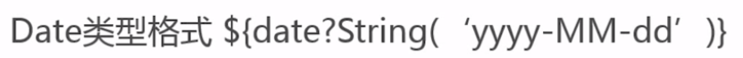

转义的html

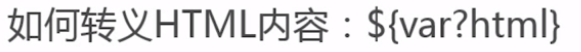

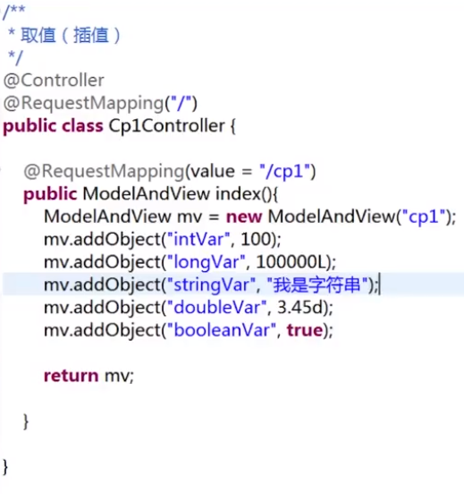

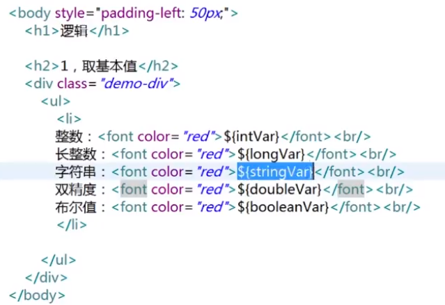

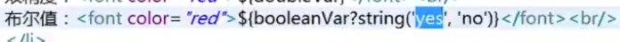

布尔值如果没有进行处理,直接显示字符串,会报错,因为布尔值是逻辑真,假,一般不用于输出字符串"true","false",可以采取上面的方式,进行格式化

Date类型,freemarker使用的java.sql.Date而不是java.util.Date

不过也可以使用java.util.Date,但是在前端需要转义

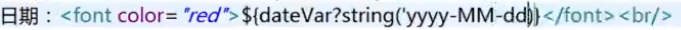

不区分单引号和双引号

变量的赋值,运算

`<#assign a=100/>`

`${a+100}`

富文本

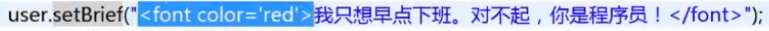

显示富文本

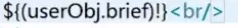

显示原始信息

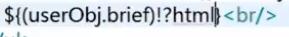

列表

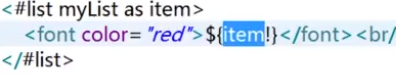

map

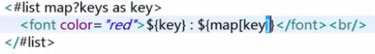

## 2. 表达式

### 2.1 if

- 判断是否为空

	- if myList?? 

	- if myList?exists

- elseif

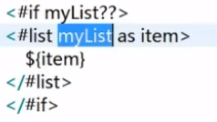

### 2.2 switch

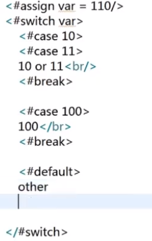

## 3. API

### 3.1 字符串

substring(a,b) 包头不包尾

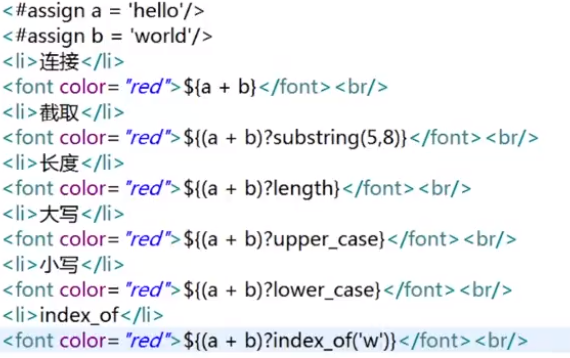

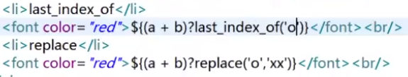

### 3.2 自定义方法

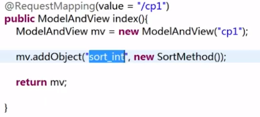

### 3.3 列表

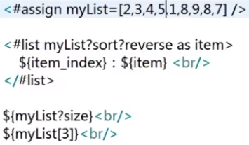

### 3.4 自定义指令

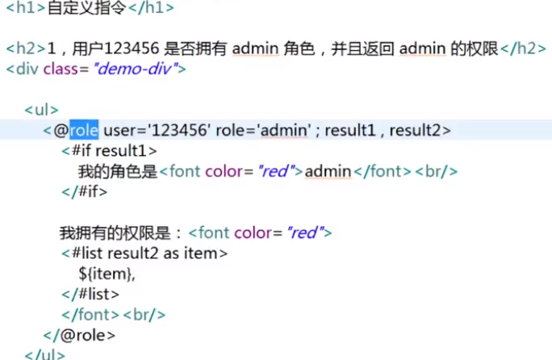

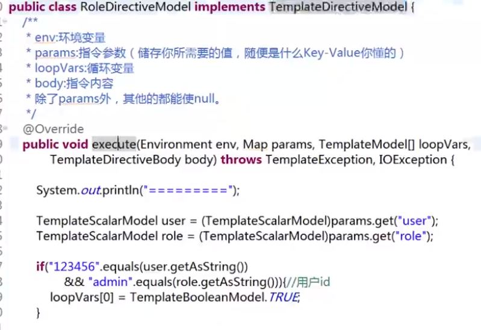

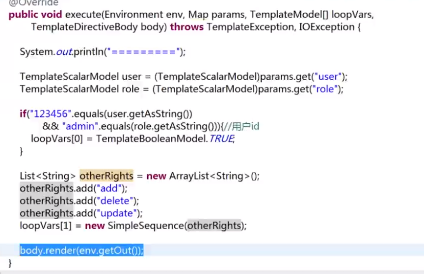

### 3.5 内建函数

字符串

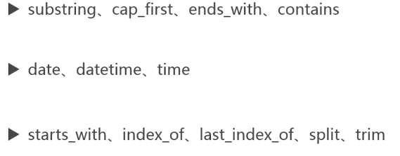

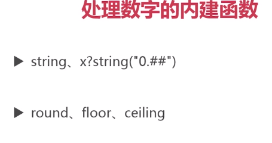

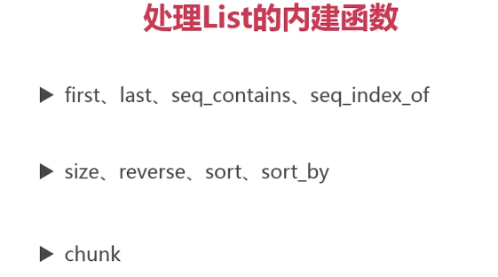

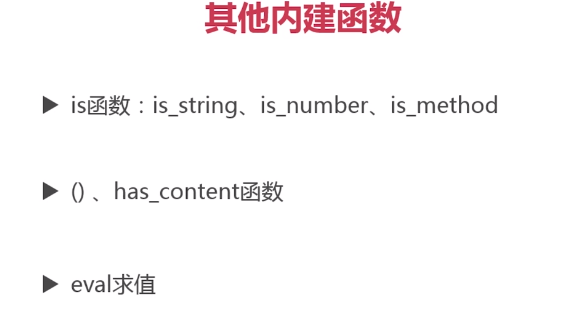

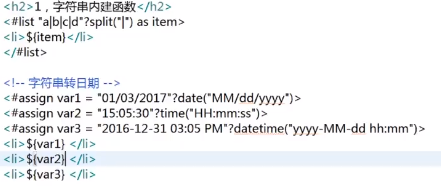

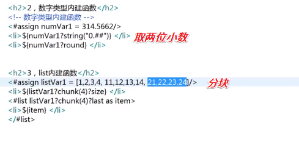

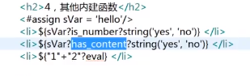

### 3.6 宏,nested,return

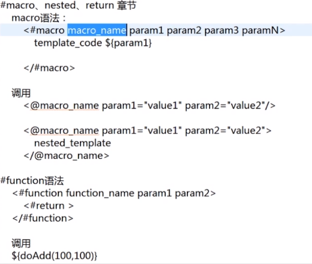

