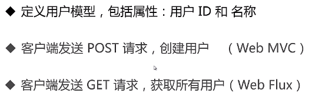
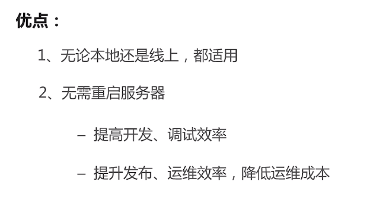
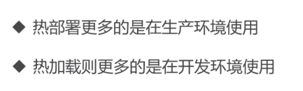
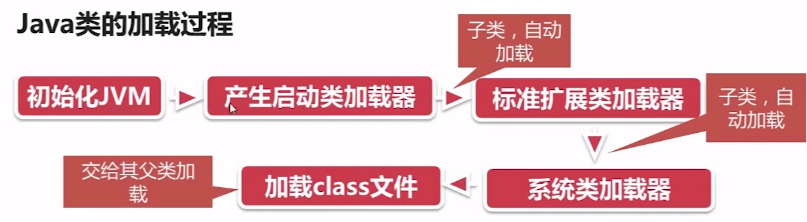
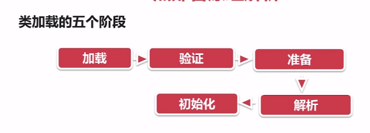
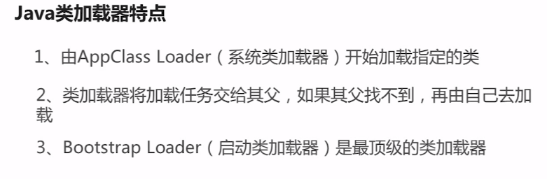
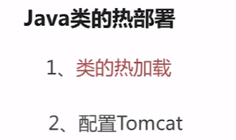
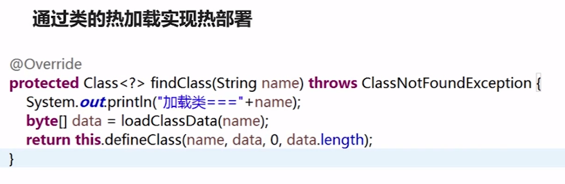
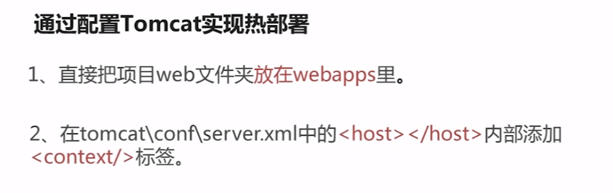
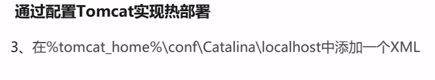

# Springboot
## 1. 2.0 特性
-  java8+,kotlin
- 底层框架 Spring Framework 5.0.x
- 全新特性--Web Flux

### 1.1 Web Flux
- 函数式编程Java8 Lambda
- 响应式编程 Reactive Streams
- 异步编程 Servlet3.1或Asyc Nio

###  1.2 场景说明

## 2. 热部署

###2.1 java热部署与热加载

联系:

-  不重启服务器编译,部署项目
- 基于java的类加载器实现

区别:

- 热部署在服务器运行时重新部署项目
- 热加载在运行时重新加载class

实现原理:

- 热部署直接重新加载整个引用
- 在运行时重新加载class

使用场景:

### 2.2 java类加载工程

