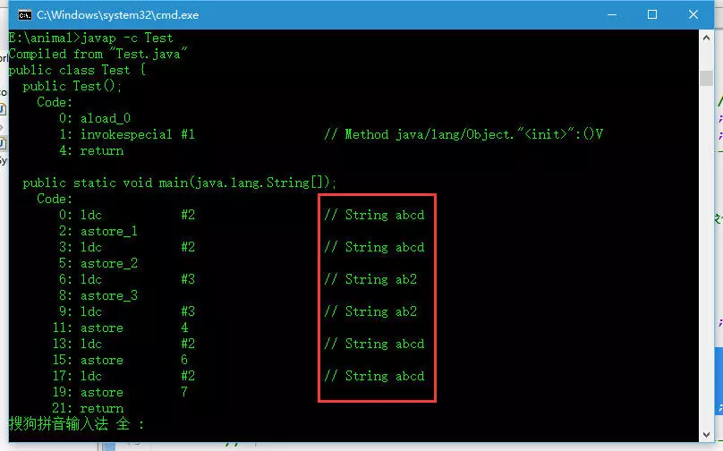
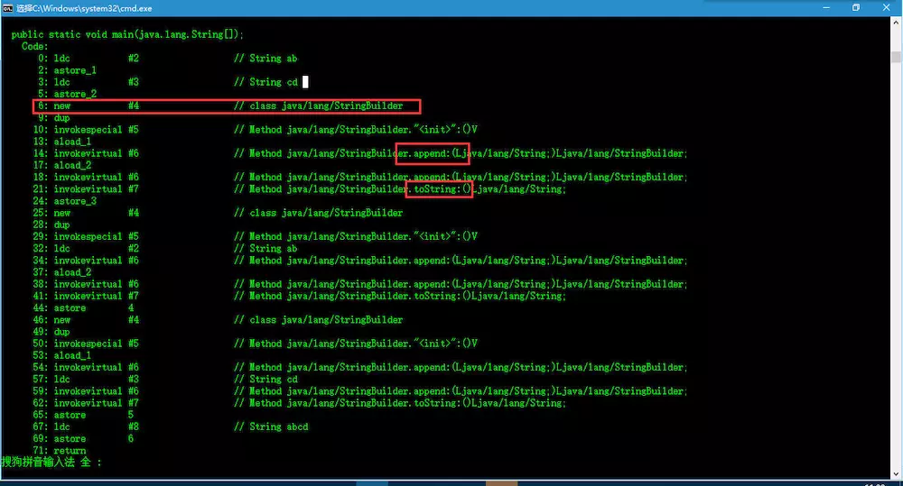
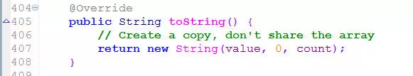
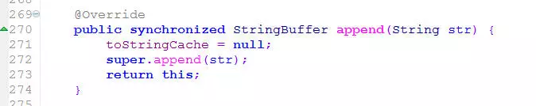
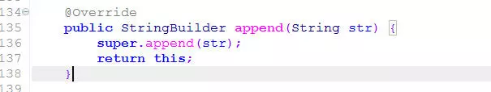

# Basic

## 1. 作用域

基本类型的作用域

String作用域

数据类型及非String类的作用域

```java
public class SampleTest {
	@Test
	public void testScope() {
		Integer val = 0;
		String aString = "11";
		Sample sample = new Sample();

		changeValue(val);
		//0
		System.out.println(val);
		
		changeString(aString);
		//11
		System.out.println(aString);
	
		changeSample(sample);
		//	Sample sample = new Sample();
		System.out.println(sample);

	}

	private static void changeValue(Integer value) {
		value += 10;
	}

	private static void changeString(String aString) {
		aString = "22";
	}
	private void changeSample(Sample sample){
		if (sample==null) return;
		sample.setAge(200);

	}
}
@Data
class Sample{
	Integer age = 100;
	String name = "sample";

```

### 1.1 String深入理解

> String的值是不可改变的
>
> String是不可被继承的


- **String的定义方法**
   一般我们在代码中可以使用如下三种方法定义String对象

```java
String str1 = new String("cat");
String str2 = "cat";
String str3 = "c"+"at";
String str4 = str1+"cat";
```


第一种方式直接通过关键字new创建对象，毫无疑问str1指向堆内存
 第二种直接赋值，Str2指向常量池
 第三种通过+号连接赋，最终str3也是指向常量池
 第四种是带三种的延伸，这个最终str4是指向堆内存
 对于前三种方式大家应该都没什么疑问，那么第四种方法为什么也会指向堆内存呢？欲知真相还需从字节码入手啊！

##### 先来看看几个经典的面试题

- First

```java
String s1 = "abc";
String s2 = "abc";
System.out.println("s1 == s2 : " + (s1 == s2)); //true
```

So esay,对吧！

- Second

```java
String s1 = "abc";
String s2 = new String("abc");
String s3 = new String("abc");
System.out.println("s2 == s3 : " + (s2 == s3)); //false
System.out.println("s1 == s3 : " + (s1 == s3));//false
```

还是很简单，对么，只要有点基础的人都知道答案呢！

- Third

```java
 public class Test{
    public static void main(String[] args){
        
        String str1 = "ab" + "cd"; // 
        String str11 = "abcd";
        //System.out.println("str1 == str11 : " + (str1 == str11)); //true
        
        String str2 = "ab"+2;
        String str22 = "ab2";
        //System.out.println("str2 == str22 : " + (str2 == str22)); //true

        final String str3 = "ab"; 
        String str31 = str3+"cd"; 
        String str32 = "abcd";
        //System.out.println("str2 = str3 : " + (str2 == str3)); // false
    }
}

    
```

这个对新手来说可能就有点不知所措了，来来来，上我们的终极利器，请看下面编译之后的**字节码**




 因为常量的值在编译期间就已经确定了，这里"ab","cd","2"都是常量，所以编译器会自动对

```java
String str1 = "ab" + "cd";String str2 = "ab"+2;
```

进行优化，效果相当于

```java
String str1 = "abcd";String str2 = "ab2";
```

 这下你明白为什么结果会是true了吧


- Fourth

```java
public class Test{
    public static void main(String[] args){     
        String str2 = "ab"; 
        String str3 = "cd"; 
        String str41 = str2 + str3;
        String str42 = "ab"+str3;
        String str43 = str2+"cd";
        String str5 = "abcd";
        //System.out.println("str41 = str5 : " + (str41 == str5)); // false
        //System.out.println("str42 = str5 : " + (str42 == str5)); // false
        //System.out.println("str43 = str5 : " + (str43 == str5)); // false
    }
}
```

这个跟例三差不多，只不过例三是常量，这里变成了变量，结果就迥然不同，下面我们来看看这段代码的字节码长啥样子




发现虚拟机在处理变量字符串用+号连接的时候是生成了一个StringBuilder对象，然后调用StringBuilder的append方法，最后在调用StringBuilder的toString方法返回。StringBuilder的toString方法源码如下：




 这下就彻底明白了吧。它是从新new一个String对象，结果当然为false了！ 

##### 针对`==`的总结如下

众所周知，`==`是判断内存地址的，那么我们判断的话看引用最终指向哪里不就可以了么

1. new出来的对象是存放在堆内存中的，引用指向堆内存，那么地址肯定是唯一的了，所以结果肯定为false
2. 直接声明的字符串引用是指向常量池的，而常量池中的相同内容的字符串只有一份，所以结果为true
3. 通过+号连接的字符串分如下两种情况
    3.1 如果+号两边连接的是常量，那么会在编译期间进行优化，结果同2
    3.2 如果+号两边连接的有变量，不管是new出来的也好，直接声明的也好，java虚拟机执行的时候都会生成一个StringBuilder对象sb，然后调用`sb.apend()`方法，最后通过`sb.toString()`返回一个新的字符串。那么此时引用就指向堆内存，结果同1

### String.intern()

当一个String实例str调用intern()方法时，虚拟机会查找常量池中是否有相同Unicode的字符串常量，如果有，则返回其的引用；如果没有，则在常量池中增加一个Unicode等于str的字符串并返回它的引用；PS:我并没有想到什么时候会没有

```java
public class Test{
    public static void main(String[] args){
        String s00 = "kvill"; 
        String s11 = new String("kvill"); 
        String s22 = new String("kvill"); 
        System.out.println( s00 == s11 ); //false
      
        s11.intern(); //虽然执行了s1.intern(),但它的返回值没有赋给s1
        s22 = s22.intern(); //把常量池中"kvill"的引用赋给s2 
        System.out.println( s00 == s11); //flase
        System.out.println( s00 == s11.intern() ); //true 说明s11.intern()返回的是常量池中"kvill"的引用
        System.out.println( s00 == s22 ); //true
    }
}
```

##### 关于String,StringBuffer,StringBuilder的区别

1. String是值不可变的，每次进行连接操作是都是返回一个新的String对象，StringBuffer,StringBuilder是值可变的，操作是返回的是this
    **这也就是为什么在进行大量字符串连接运算时，不推荐使用String，而推荐StringBuffer和StringBuilder。** 
2. StringBuffer是线程同步的，安全性高，但执行效率低
    StringBuilder是非线程同步的，安全性低，但执行效率高

这是StringBuffer,StringBuilder append方法的源码




