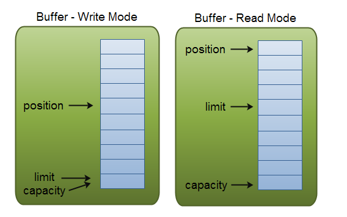

# NIO

## 1. NIO和IO的区别

- IO是以字节进行读取的
- NIO是以块进行读取的

## 2. 通道和缓冲区

### 2.1 缓冲区

- Buffer 是一个对象， 它包含一些要写入或者刚读出的数据。
- 缓冲区实质上是一个数组。通常它是一个字节数组，但是也可以使用其他种类的数组。但是一个缓冲区不 仅仅 是一个数组。缓冲区提供了对数据的结构化访问，而且还可以跟踪系统的读/写进程。

#### 2.1.1 缓冲区类型

- ByteBuffer.最常用的
- CharBuffer
- ShortBuffer
- IntBuffer
- LongBuffer
- FloatBuffer
- DoubleBuffer

#### 2.1.2 ByteBuffer方法
1. 缓冲区设置
    - allocate(int bytes) 
        - 分配一个bytes字节数的缓冲区 
    - clear() 
        - 清空缓冲区.原来还未读的数据会被遗忘
    - compact() 
        - 清空已读的数据,并保留未读的数据
    - flip() 
        -  当需要读数据时，通过flip()方法把buffer从写模式调整为读模式；在读模式下，可以读取所有已经写入的数据。调用flip方法会把position归零，并设置limit为之前的position的值。也就是说，现在position代表的是读取位置，limit标示的是已写入的数据位置。
    - rewind() 
        - 将position设置为0,这样可以重复读取buffer里面的数据,limit保持不变
    - final Buffer position(int newPosition)
    - final Buffer limit(int newLimit)
    - position()
    - limit()
    - capacity()
    - slice()
        - 根据现有的缓冲区创建一种子缓冲区.
        - 子缓冲区与原来的缓冲区共享数据

```java
ByteBuffer buffer = ByteBuffer.allocate(10);
for (int i = 0; i < buffer.capacity(); ++i) {
    buffer.put((byte) i);
}

buffer.position(3);
buffer.limit(7);

//子缓冲区
ByteBuffer slice = buffer.slice();

for (int i = 0; i < slice.capacity(); ++i) {
    byte b = slice.get(i);
    b *= 11;
    slice.put(i, b);
}
//
buffer.position(0);
buffer.limit(buffer.capacity());

while (buffer.remaining() > 0) {
    System.out.println(buffer.get());
}
while (slice.hasRemaining()){
    System.out.println("position : "+slice.position()+" data : "+slice.get());
}
```

2. 写入到缓冲区
    - ByteBuffer put(byte x)
        - 写入一个元素并position+1
    - ByteBuffer putInt(int x) 
        - 插入到当前的位置
    - ByteBuffer putLong(int x)
    - ByteBuffer putDouble(int x)
    - ByteBuffer putChar(int x)
    - static ByteBuffer wrap(byte[] array)
        - 将一个数组包装为缓存区
        - 必须非常小心地进行这类操作。一旦完成包装，底层数据就可以通过缓冲区或者直接访问。
    - ByteBuffer put(int i, byte x)
        - 指定的索引写入一个元素
    - final ByteBuffer put(byte[] src)
        - 写入一个自己数组，position+=src.length
    - ByteBuffer put(byte[] src, int offset, int length)
        - 从一个自己数组的offset开始length个元素写入到ByteBuffer中，position+=length
    - ByteBuffer put(ByteBuffer src)
        - 写入一个ByteBuffer，position+=写入的元素个数
3. 从缓冲区中读取
    - get() 
        - 读取一个字节
    - ByteBuffer get(byte[] dst) 从当前的position读取元素到dst数组,每填充一个元素position+1.
            - 返回的是  byteBuffer
            - dst已经改变
    - ByteBuffer get(byte[] dst, int offset, int length) 
        - 从当前position中读取元素到dst数组的offset下标开始填充length个元素。 
    - byte get(int index) 
        - 读取指定索引的字节
    - int getInt()
        - 从当前的position开始读取一个int
    - int getLong()
    - int getDouble()
    - int getChar()


- equals() 
    - 类型 是否 相同
    - buffer剩余的 字节数 是否 相同
    - 所有的剩余 字节 是否  相等
- compareTo() 
    - 比较buffer中的剩余元素,用于排序


#### 2.1.3 容量capacity,位置position,上限limit



> 在不同的教程中,读和写的意义可能是相反的!!!! 

1. 容量capacity
就是最多只能写入容量值得字节，整形等数据。一旦buffer写满了就需要清空已读数据以便下次继续写入新的数据。

2. 位置（Position）
- 当写入数据到Buffer的时候需要中一个确定的位置开始
    - 默认初始化时这个位置position为0
    - 一旦写入了数据比如一个字节，整形数据，那么position的值就会指向数据之后的一个单元
    - position最大可以到capacity-1.

- 当从Buffer读取数据时，也需要从一个确定的位置开始。
    - buffer从写入模式变为读取模式时，position会归零
    - 每次读取后，position向后移动。

3. 上限（Limit）
- 写模式，limit的含义是我们所能写入的最大数据量。它等同于buffer的容量。

- 读模式，limit则代表我们所能读取的最大数据量，他的值等同于写模式下position的位置。

数据读取的上限时buffer中已有的数据，也就是limit的位置（原position所指的位置）。

### 2.2 通道

1. 简介
    - Channel是一个对象，可以通过它读取和写入数据。
    - 拿 NIO 与原来的 I/O 做个比较，通道就像是流。
    - 所有数据都通过 Buffer对象来处理。
    - 读取/写入:-->通道-->缓冲区
    - 通道与流的不同之处在于通道是双向的。可以用于读、写或者同时用于读写。
    - 通道可以异步读写
2. 方法
    - int read(ByteBuffer buf) 

### 2.3 缓冲区类别

1. 只读缓冲区
    - ByteBuffer asReadOnlyBuffer() 由原来的缓冲区生成一个新的缓冲区
    - 这个缓冲区与原来的缓冲区共享数据
2. 直接缓冲区
    - SUN定义: `给定一个直接字节缓冲区，Java 虚拟机将尽最大努力直接对它执行本机 I/O 操作。`
    - 为了提高速度
    - static ByteBuffer allocateDirect(int capacity)
3. 间接缓冲区
4. 内存映射文件IO


## 3. 异步IO

> 异步IO是一种`没有阻塞地读写数据`的方法.

### 3.1 同步与异步的区别
1. 阻塞
- 同步IO,读操作有可能会被阻塞,写操作必定阻塞
- 异步IO不会阻塞. 通过注册对特定 I/O 事件― 可读的数据的到达、新的套接字连接，等等，而在发生这样的事件时，系统将会告诉您。

2. 异步的优势
- 同步需要做大量的轮训,或创建很多的线程处理大量的连接.
- 异步,可以监听任何通道的事件,不用做轮训,不需要额外的线程