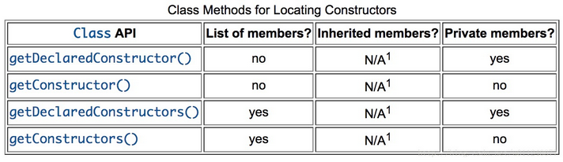
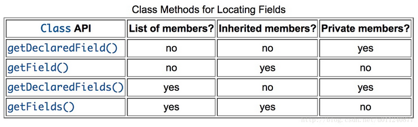
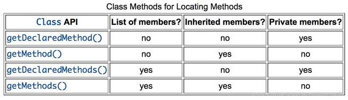

# 反射
## 1. Filed
### 1.1 获取类型
- Field.getType()：返回这个变量的类型
- Field.getGenericType()：如果当前属性有签名属性类型(泛型类型)就返回，否则就返回 Field.getType()
### 1.2 获取变量修饰符
1. 修饰符
    - 访问权限控制符：public, protected, private
    - 限制只能有一个实例的：static
    - 不允许修改的：final
    - 不会被序列化：transient
    - 线程共享数据的一致性：volatile
    - 注解
2. Modifier
PUBLIC: 1
PRIVATE: 2
PROTECTED: 4
STATIC: 8
FINAL: 16
SYNCHRONIZED: 32
VOLATILE: 64
TRANSIENT: 128
NATIVE: 256
INTERFACE: 512
ABSTRACT: 1024
STRICT: 2048
3. 使用getModifier获取Filed的Modifier
```java
Modifier.toString(field.getModifier());
```
### 1.3 获取\修改域变量的值
- getName() ： 获取属性的名字
- get(Object obj) 返回指定对象obj上此 Field 表示的字段的值
- set(Object obj, Object value) 将指定对象变量上此 Field 对象表示的字段设置为指定的新值


## 2. Class
### 2.1 获取Class 对象
- Class<?> getClass()
- Object.class
- Class<?> forName(String className)--className是完整的类路径
- 利用TYPE
- Class.getSuperclass()--返回调用类的父类
- Class.getClasses()--返回调用类的所有公共类、接口、枚举组成的 Class 数组，包括继承的
- Class.getDeclaredClasses()--返回调用类显式声明的所有类、接口、枚举组成的 Class 数组
- Class.getDeclaringClass()
- 返回类/属性/方法/构造器所在的类
- java.lang.reflect.Field.getDeclaringClass()
- java.lang.reflect.Method.getDeclaringClass()
- java.lang.reflect.Constructor.getDeclaringClass()


```java
String aString="hello";
int aInt=1;
Class strClass=aString.getClass();
Class intClass=aInt.getClass();

Class a=Sting.class;
Class b = int[][].class;
```

对于基本类型和 void 的包装类，还有另外一种方式获得 Class，那就是静态属性 TYPE 。
每个包装类都有 TYPE 属性，以 Double 为例：
```java
public static final Class<Double> TYPE
        = (Class<Double>) double[].class.getComponentType();
```
可以看到这个属性就是使用 .class 的方式获得 Class 并保存。
因此我们可以直接调用包装类的 TYPE：
```java
Class<Integer> integerWrapper = Integer.TYPE;
Class<Double> doubleWrapper = Double.TYPE;
Class<Void> voidWrapper = Void.TYPE;
```


### 2.2 Class的成员Member
Member有三个实现类
- Constructor
- Field
- Method

#### 2.2.1 获取构造函数

- getDeclaredConstructor()
- getConstructor()
- getDeclaredConstructors()
- getConstructors()

> NOTE: 构造函数无法从父类继承

#### 2.2.2 获取成员变量

- getDeclaredField(String fieldName)
- getField(String fieldName)
- getDeclaredFields()
- getFields()

#### 2.2.3 获取方法

- getDeclaredMethod()
- getMethod()
- getDeclaredMethods()
- getMethods()

## 3. Method
### 方法
|方法 |	描述|
|---|---|
|boolean equals(Object obj)               |将此方法与指定的对象进行比较。|
|T getAnnotation(Class annotationClass)   |如果存在这样的注释，则返回该元素的指定类型的注释，否则返回null。|
|Annotation[] getDeclaredAnnotations()    |返回此元素上直接存在的所有注释。|
|Class getDeclaringClass()                |返回表示声明由此Method对象表示方法类的Class对象。|
|Object getDefaultValue()                 |返回此Method实例表示的注释成员的默认值。|
|Class<?>[] getExceptionTypes()           |返回一个Class对象数组，该数组表示由此构造方对象表示的底层构造函数声明的异常类型。|
|Type[] getGenericExceptionTypes()        |返回一个Type对象的数组，表示声明为此Constructor对象抛出的异常。|
|Type[] getGenericParameterTypes()        |返回一个Type对象数组，它以声明顺序表示由此构造方法对象表示的方法的形式参数类型。|
|Type getGenericReturnType()              |返回一个Type对象，该对象表示此Method对象表示的方法的正式返回类型。|
|int getModifiers()                       |返回由此Method对象表示的方法的Java语言修饰符，以整数形式返回。|
|String getName()                         |以字符串形式返回此方法的名称。|
|Annotation[][] getParameterAnnotations() |返回一个数组数组，它们以声明顺序表示由此Method对象表示的方法的形式参数的注释。|
|Class<?>[] getParameterTypes()           |返回一个Class对象数组，它们以声明顺序表示由此Method对象表示的构造函数的形式参数类型。|
|Class<?> getReturnType()                 |返回一个Class对象，该对象表示此Method对象表示的方法的正式返回类型。|
|int hashCode()                           |返回此构造函数的哈希码。|
|Object invoke(Object obj, Object…args)   |在具有指定参数的指定对象上调用此Method对象表示的底层方法。|
|boolean isBridge()                       |如果此方法是桥接方法，则返回true; 否则返回false。|
|boolean isSynthetic()                    |如果此方法是合成方法，则返回true; 否则返回false。|
|boolean isVarArgs()                      |如果此方法被声明为使用可变数量的参数，则返回true; 否则返回false。|
|String toGenericString()                 |返回描述此方法的字符串，包括类型参数。|
|String toString()                        |返回描述此方法的字符串。|

## 4.AccessibleObject--访问权限
> AccessibleObject是Method,Field,Constructor的基类
### 4.1 方法
|构造函数|描述|
|---|---|
|T getAnnotation(Class annotationClass) 	|如果存在注解，则返回该元素的指定类型的注解，否则返回null。|
|Annotation[] getAnnotations()          	|返回此元素上存在的所有注解。|
|Annotation[] getDeclaredAnnotations()  	|返回此元素上直接存在的所有注解。|
|boolean isAccessible() 	                |获取此对象的可访问标志的值。|
|boolean isAnnotationPresent(Class<? extends Annotation> annotationClass) 	|如果此元素上存在指定类型的注解，则返回true，否则返回false。|
|static void setAccessible(AccessibleObject[] array, boolean flag) 	|使用单一安全检查来设置对象数组的可访问标志的一个方便的方法(为了效率)。|
|void setAccessible(boolean flag) 	        |将此对象的可访问标志设置为指示的布尔值。|