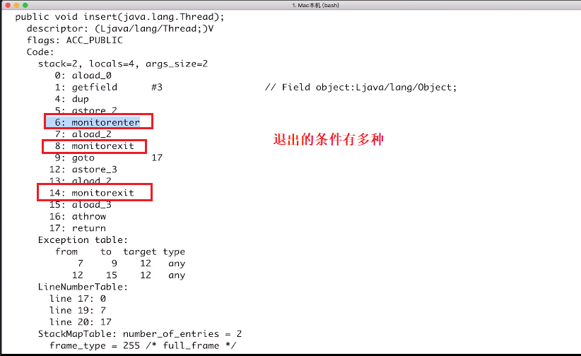

Synchronize

## 1.基础

### 1.1方法

Thread

isAlive()--是否存活

join() --等待当前线程的结束

```java
public class DisappearRequest1 implements Runnable {
	static int i = 1;
	static DisappearRequest1 instance = new DisappearRequest1();


	public static void main(String[] args) throws InterruptedException {
		Thread thread1 = new Thread(instance);
		Thread thread2= new Thread(instance);
		thread1.start();
		thread2.start();

		//线程执行完毕之后才能执行下一步骤
		thread1.join();
		thread2.join();
		System.out.println(i);
	}

	@Override
	public void run() {
		for (int j = 0; j < 100000; j++) {
			i++;

		}
	}
}
```

输出的结果正确

执行的操作

1. 读取i

2. i+1
3. 写入内存

执行结果不正确的原因

> 如果有两个同时读取+1,写入到内存的时候只加了一次,由此造成了错误


### 1.2 IDEA的调试线程


1. 右击断点.选择所有都进入断点,还是当前线程进入断点


2. 按照图示.1.2.3.输入命令后可以查询线程的状态.`this.getState()`


3. 切换线程.


## 2. 两种锁


### 2.1 对象锁

1. 直接锁住指定的对象
2. 使用方法锁(默认使用this作为锁对象)

```java
/**
 * @description: 对象锁, 代码块形式
 * 加锁的时候需要注意,怎么加锁才能锁住所有需要资源,尤其是对象比较多的时候
 * @author: SunBiaoLong
 * @create: 2019-07-11 11:19
 **/
public class SynchronizedObjectCodeBlock {
	public static void main(String[] args) {
//		test(new MyThread1());
		test(new MyThread2());
//		test(new MyThread3());

	}

	static void test(Runnable runnable) {
		Thread thread = new Thread(runnable);
		Thread thread2 = new Thread(runnable);
		thread.start();
		thread2.start();
		while (thread.isAlive() || thread2.isAlive()) {

		}
		System.out.println("end");

	}
}

/**
 * 使用synchronize(this)和synchronized(lock)结果一样
 */
class MyThread1 implements Runnable {
	static MyThread1 myThread1 = new MyThread1();
	Object lock1 = new Object();

	@Override
	public void run() {
//		synchronized (this){
		synchronized (lock1) {
			System.out.println("我是线程 " + Thread.currentThread().getName());
			try {
				Thread.sleep(3000);
			} catch (InterruptedException e) {
				e.printStackTrace();
			}
			System.out.println("我是线程 " + Thread.currentThread().getName() + "结束");
		}

	}
}

/**
 * 两个不同的锁对象--加锁的时候需要注意,怎么加锁才能锁住所有需要资源,尤其是对象比较多的时候
 * 我是lock1 Thread-0
 * 我是lock1 Thread-0结束
 * 我是lock2 Thread-0
 * 我是lock1 Thread-1
 * 我是lock2 Thread-0结束
 * 我是lock1 Thread-1结束
 * 我是lock2 Thread-1
 * 我是lock2 Thread-1结束
 * end
 */
class MyThread2 implements Runnable {
	static MyThread1 myThread1 = new MyThread1();
	Object lock1 = new Object();
	Object lock2 = new Object();

	@Override
	public void run() {
		synchronized (lock1) {
			System.out.println("我是lock1 " + Thread.currentThread().getName());
			try {
				Thread.sleep(3000);
			} catch (InterruptedException e) {
				e.printStackTrace();
			}
			System.out.println("我是lock1 " + Thread.currentThread().getName() + "结束");
		}
		synchronized (lock2) {
			System.out.println("我是lock2 " + Thread.currentThread().getName());
			try {
				Thread.sleep(3000);
			} catch (InterruptedException e) {
				e.printStackTrace();
			}
			System.out.println("我是lock2 " + Thread.currentThread().getName() + "结束");
		}
	}
}

/**
 * 我是lock1 Thread-0
 * 我是lock1 Thread-0结束
 * 我是lock2 Thread-0
 * 我是lock2 Thread-0结束
 * 我是lock1 Thread-1
 * 我是lock1 Thread-1结束
 * 我是lock2 Thread-1
 * 我是lock2 Thread-1结束
 * end
 */
class MyThread3 implements Runnable {
	static MyThread1 myThread1 = new MyThread1();
	Object lock1 = new Object();
	Object lock2 = new Object();

	@Override
	public void run() {
		synchronized (lock1) {
			System.out.println("我是lock1 " + Thread.currentThread().getName());
			try {
				Thread.sleep(3000);
			} catch (InterruptedException e) {
				e.printStackTrace();
			}
			System.out.println("我是lock1 " + Thread.currentThread().getName() + "结束");
		}
		synchronized (lock1) {
			System.out.println("我是lock2 " + Thread.currentThread().getName());
			try {
				Thread.sleep(3000);
			} catch (InterruptedException e) {
				e.printStackTrace();
			}
			System.out.println("我是lock2 " + Thread.currentThread().getName() + "结束");
		}
	}
}
```


```java

/**
 * @description: 对象锁2--方法锁
 * @author: SunBiaoLong
 * @create: 2019-07-11 11:52
 **/
public class SynchronizedObjectMethod {
	public static void main(String[] args) {
		test(new MyMethodThread());
//		test(new MyThread2());
//		test(new MyThread3());

	}

	static void test(Runnable runnable) {
		Thread thread = new Thread(runnable);
		Thread thread2 = new Thread(runnable);
		thread.start();
		thread2.start();
		while (thread.isAlive() || thread2.isAlive()) {

		}
		System.out.println("end");

	}
}


class MyMethodThread implements Runnable {

	@Override
	public void run() {
		test();
	}

	public synchronized void test() {
		System.out.println("我是对象方法锁" + Thread.currentThread().getName());
		try {
			Thread.sleep(2000);
		} catch (InterruptedException e) {
			e.printStackTrace();
		}
		System.out.println("我是对象方法锁" + Thread.currentThread().getName() + "结束");

	}
}
```

### 2.2 类锁


## 3. 7个问题


1. 顺序执行.
2. 并行执行
3. 顺序执行
4. 不受影响.同时执行
5. 顺序执行(`synchronized`默认加锁是**`this`**)
6. 并行执行
7. 正确


## 4. 可重入性质

### 4.1可重入


优点

1. 避免死锁
2. 提升封装性

粒度

> 是线程而非调用


```java
/**
 * @description: 可重入性质
 * 通过下面三个示例说明,只要该线程获得锁,都是可重入的
 * @author: SunBiaoLong
 * @create: 2019-07-12 11:06
 **/
public class SynchronizedRecursion {
	public static void main(String[] args) {
//		test(new SingleSynMethodRecur());
//		test(new TwoSynMethodRecur());
		test(new ChildRecur());
	}

	static void test(Runnable runnable) {
		Thread thread = new Thread(runnable);
		thread.start();
		while (thread.isAlive()) {

		}
		System.out.println("end");

	}
}

/**
 * 一个方法的可重入性质
 * 回调过程中,锁已经获得,不需要重新获取
 */
class SingleSynMethodRecur implements Runnable {
	/**
	 * 这里不使用static也可以
	 */
	static int value = 1;
	@Override
	public void run() {
		method1();
	}

	protected synchronized void method1() {
		System.out.println("value:"+value);
		if (value==1){
			value++;
			method1();
		}
	}


}
/**
 * 两个加锁方法,一个方法调用另外一个,不会出现问题
 */
class TwoSynMethodRecur implements Runnable {
	@Override
	public void run() {
		if (Thread.currentThread().getName().equals("Thread-0")) {
			method1();
		} else {
			method2();
		}
	}

	private synchronized void method1() {
		method2();
		System.out.println("this is method 1");
	}

	private  synchronized  void method2() {
		System.out.println("this is method 2");
	}
}

/**
 * 子类可以调用父类的同步方法
 */
class ChildRecur extends SingleSynMethodRecur{
	@Override
	public void run() {
		method2();
	}
	private void method2(){
		super.method1();
		System.out.println("this is method 2");
	}
}
```


4.2 不可中断


## 5. 原理


5.1 加锁和释放锁的原理


注意编码格式使用`-encoding utf-8`可以配置编码格式




6. Synchronized缺陷


使用`Lock`

```java
	public static void main(String[] args) {
		Lock lock = new ReentrantLock();
		//加锁
		lock.lock();
//		解锁
		lock.unlock();
		//尝试获得一把锁
		final boolean b = lock.tryLock();
		//尝试获得一把锁,并设置超时时间
		try {
			final boolean b1 = lock.tryLock(10, TimeUnit.SECONDS);
		} catch (InterruptedException e) {
			e.printStackTrace();
		}
	}
```


