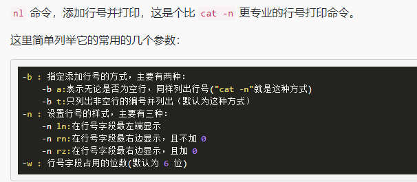
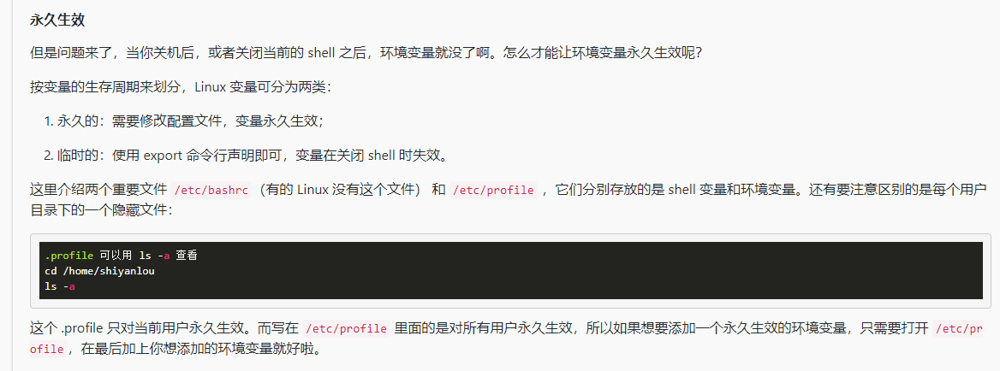
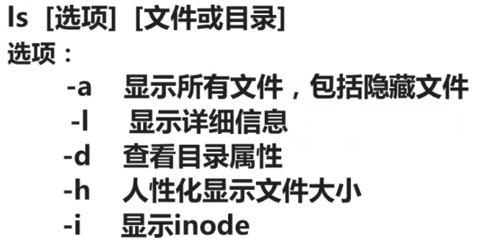

# Linux-Basic

## 1. 文件结构


常用文件目录


查看文件结构

`tree \`

如果出现了错误


使用以下命令安装

```shell
sudo apt-get update

sudo apt-get install tree
```

运行`tree \`之后发现这个目录太长......


### 1.1 路径

```shell
# 上一级
cd ..
# 打开home目录
cd ~
# 获取当前路径
pwd
# 可以直接使用绝对路径
cd 绝对路径

# 创建目录
mkdir mydir
# 创建多级目录
mkdir a/b/c
```


### 1.2 文件(夹)操作

```shell
# 复制文件
cp a.txt a/b/c

# 复制文件夹 使用-r 或 -R
cp -r a x

# 删除
rm a.txt

# 删除文件 不管权限
rm -f a.txt

# 删除目录
rm -r a

# 移动文件到文件夹
mv file1 doc

# 重命名
mv file1 myfile

# 批量重命名
touch file{1..5}.txt
rename 's/\.txt\.c/' *.txt # 将.txt重命名为.c
rename'y/a-z/A-Z' *.c #文件名和后缀改为大写

# rename可能会失败
# 可以安装rename,然后重启终端

# 查看文件
# cat正序  tac 倒序
# cat -n 显示行号
# nl 添加行号并打印

```




 查看文件类型


### 1.3 变量

```shell
# 创建一个变量
declare tmp

# 赋值
tmp=longer

# 读取变量的值 $--引用一个值
echo $tmp
```




### 1.4 基础小课堂


### 1.5 下载，解压

```shell
# 下载
wget 资源路径
wget -p uri #解压到指定的目录
# 解压tar

```

1．命令格式：

tar[必要参数][选择参数][文件] 

2．命令功能：

用来压缩和解压文件。tar本身不具有压缩功能。他是调用压缩功能实现的 

3．命令参数：

必要参数有如下：

-A 新增压缩文件到已存在的压缩

-B 设置区块大小

-c 建立新的压缩文件

-d 记录文件的差别

-r 添加文件到已经压缩的文件

-u 添加改变了和现有的文件到已经存在的压缩文件

-x 从压缩的文件中提取文件

-t 显示压缩文件的内容

-z 支持gzip解压文件

-j 支持bzip2解压文件

-Z 支持compress解压文件

-v 显示操作过程

-l 文件系统边界设置

-k 保留原有文件不覆盖

-m 保留文件不被覆盖

-W 确认压缩文件的正确性


可选参数如下：

-b 设置区块数目

-C 切换到指定目录

-f 指定压缩文件

--help 显示帮助信息

--version 显示版本信息


4．常见解压/压缩命令


tar 
解包：tar xvf FileName.tar
打包：tar cvf FileName.tar DirName
（注：tar是打包，不是压缩！）


.gz
解压1：gunzip FileName.gz
解压2：gzip -d FileName.gz
压缩：gzip FileName

.tar.gz 和 .tgz
解压：tar zxvf FileName.tar.gz
压缩：tar zcvf FileName.tar.gz DirName

.bz2
解压1：bzip2 -d FileName.bz2
解压2：bunzip2 FileName.bz2
压缩： bzip2 -z FileName

.tar.bz2
解压：tar jxvf FileName.tar.bz2
压缩：tar jcvf FileName.tar.bz2 DirName

.bz
解压1：bzip2 -d FileName.bz
解压2：bunzip2 FileName.bz
压缩：未知

.tar.bz
解压：tar jxvf FileName.tar.bz
压缩：未知

.Z
解压：uncompress FileName.Z
压缩：compress FileName

.tar.Z
解压：tar Zxvf FileName.tar.Z
压缩：tar Zcvf FileName.tar.Z DirName

.zip
解压：unzip FileName.zip
压缩：zip FileName.zip DirName

.rar
解压：rar x FileName.rar
压缩：rar a FileName.rar DirName 

 

5．使用实例

实例1：将文件全部打包成tar包

命令：

tar -cvf log.tar log2012.log

tar -zcvf log.tar.gz log2012.log

tar -jcvf log.tar.bz2 log2012.log

输出：

[root@localhost test]# ls -al log2012.log

---xrw-r-- 1 root root 302108 11-13 06:03 log2012.log

[root@localhost test]# tar -cvf log.tar log2012.log 

log2012.log

[root@localhost test]# tar -zcvf log.tar.gz log2012.log

log2012.log

[root@localhost test]# tar -jcvf log.tar.bz2 log2012.log 

log2012.log

[root@localhost test]# ls -al *.tar*

-rw-r--r-- 1 root root 307200 11-29 17:54 log.tar

-rw-r--r-- 1 root root   1413 11-29 17:55 log.tar.bz2

-rw-r--r-- 1 root root   1413 11-29 17:54 log.tar.gz

说明：

tar -cvf log.tar log2012.log    仅打包，不压缩！ 

tar -zcvf log.tar.gz log2012.log   打包后，以 gzip 压缩 

tar -zcvf log.tar.bz2 log2012.log  打包后，以 bzip2 压缩 

在参数 f 之后的文件档名是自己取的，我们习惯上都用 .tar 来作为辨识。 如果加 z 参数，则以 .tar.gz 或 .tgz 来代表 gzip 压缩过的 tar包； 如果加 j 参数，则以 .tar.bz2 来作为tar包名。


实例2：查阅上述 tar包内有哪些文件

命令：

tar -ztvf log.tar.gz

输出：

[root@localhost test]# tar -ztvf log.tar.gz

---xrw-r-- root/root    302108 2012-11-13 06:03:25 log2012.log

说明：

由于我们使用 gzip 压缩的log.tar.gz，所以要查阅log.tar.gz包内的文件时，就得要加上 z 这个参数了。


实例3：将tar 包解压缩

命令：

tar -zxvf /opt/soft/test/log.tar.gz

输出：

[root@localhost test3]# ll

总计 0[root@localhost test3]# tar -zxvf /opt/soft/test/log.tar.gz

log2012.log

[root@localhost test3]# ls

log2012.log

[root@localhost test3]#


说明：

在预设的情况下，我们可以将压缩档在任何地方解开的


实例4：只将 /tar 内的 部分文件解压出来

命令：

tar -zxvf /opt/soft/test/log30.tar.gz log2013.log

输出：

[root@localhost test]# tar -zcvf log30.tar.gz log2012.log log2013.log 

log2012.log

log2013.log

[root@localhost test]# ls -al log30.tar.gz 

-rw-r--r-- 1 root root 1512 11-30 08:19 log30.tar.gz

[root@localhost test]# tar -zxvf log30.tar.gz log2013.log

log2013.log

[root@localhost test]# ll

-rw-r--r-- 1 root root   1512 11-30 08:19 log30.tar.gz

[root@localhost test]# cd test3

[root@localhost test3]# tar -zxvf /opt/soft/test/log30.tar.gz log2013.log

log2013.log

[root@localhost test3]# ll

总计 4

-rw-r--r-- 1 root root 61 11-13 06:03 log2013.log

[root@localhost test3]#

说明：

我可以透过 tar -ztvf 来查阅 tar 包内的文件名称，如果单只要一个文件，就可以透过这个方式来解压部分文件！


实例5：文件备份下来，并且保存其权限

命令：

tar -zcvpf log31.tar.gz log2014.log log2015.log log2016.log 

输出：

[root@localhost test]# ll

总计 0

-rw-r--r-- 1 root root      0 11-13 06:03 log2014.log

-rw-r--r-- 1 root root      0 11-13 06:06 log2015.log

-rw-r--r-- 1 root root      0 11-16 14:41 log2016.log

[root@localhost test]# tar -zcvpf log31.tar.gz log2014.log log2015.log log2016.log 

log2014.log

log2015.log

log2016.log

[root@localhost test]# cd test6

[root@localhost test6]# ll

[root@localhost test6]# tar -zxvpf /opt/soft/test/log31.tar.gz 

log2014.log

log2015.log

log2016.log

[root@localhost test6]# ll

总计 0

-rw-r--r-- 1 root root 0 11-13 06:03 log2014.log

-rw-r--r-- 1 root root 0 11-13 06:06 log2015.log

-rw-r--r-- 1 root root 0 11-16 14:41 log2016.log

[root@localhost test6]#

说明：

这个 -p 的属性是很重要的，尤其是当您要保留原本文件的属性时

实例6：在 文件夹当中，比某个日期新的文件才备份

命令：

tar -N "2012/11/13" -zcvf log17.tar.gz test

输出：

[root@localhost soft]# tar -N "2012/11/13" -zcvf log17.tar.gz test

tar: Treating date `2012/11/13' as 2012-11-13 00:00:00 + 0 nanoseconds

test/test/log31.tar.gz

test/log2014.log

test/linklog.log

test/log2015.log

test/log2013.log

test/log2012.log

test/log2017.log

test/log2016.log

test/log30.tar.gz

test/log.tar

test/log.tar.bz2

test/log.tar.gz

说明：


实例7：备份文件夹内容是排除部分文件

命令：

tar --exclude scf/service -zcvf scf.tar.gz scf/*

输出：

[root@localhost test]# tree scf

scf

|-- bin

|-- doc

|-- lib

`-- service

   	 `-- deploy

​       	 	|-- info

​       	 	`-- product


7 directories, 0 files

[root@localhost test]# tar --exclude scf/service -zcvf scf.tar.gz scf/* 

scf/bin/

scf/doc/

scf/lib/

[root@localhost test]#


## X. 常用命令

### X.1 常用命令

ls 列出文件，及文件夹

ll  相当于 ls -l

ls -l 列出文件夹详情

ls -a 列出文件夹的所有内容，包括以`.`开头的隐藏文件




cd - 进入上次目录

cd /usr/local/s  # 打开 /usr/local/目录下以s开头的文件

cat 读取指定文件的内容并打印到终端数据

touch a.txt 创建文件

touch a.txt b.txt 

touch file_{1..10}.txt 创建10个文件


### X.2 用户相关

sudo adduser--添加用户

su root 切换用户

groups root 查看当前用户属于哪一个用户组

who am i当前伪登录用户

whoami当前用户

sudo deluser lilei --remove-home删除用户


