# Spring

## 1. Bean的装配与注入
### 1.1 注入
- 构造器注入
- setter注入
- 接口注入(JNDI--java naming and directory interface)

### 1.1 采用XMl方式装配
- 普通装配
- 装配集合
- 命名空间装配

```java
<bean id="role" class="com.longer.demo.Role">
    <property name="roleName" value="admin"/>
    <property name="id" value="1"/>
</bean>
<!-- 引用 -->

```

### 1.2 spring加载文件的方式

一：ClassPathXmlApplicationContext 

```java
// 1.没有前缀：默认为项目的classpath下相对路径 
   ApplicationContext appCt = new ClassPathXmlApplicationContext("app.spring.xml"); 

// 2.前缀classpath：表示的是项目的classpath下相对路径 
   ApplicationContext appCt = new ClassPathXmlApplicationContext("classpath:app.spring.xml"); 

// 3.使用前缀file 表示的是文件的绝对路径 
   ApplicationContext appCt = new ClassPathXmlApplicationContext("file:D:/app.spring.xml"); 

// 4.可以同时加载多个文件 
  String[] xmlCfg = new String[] { "classpath:base.spring.xml","app.spring.xml"}; 
  ApplicationContext appCt = new ClassPathXmlApplicationContext(xmlCfg); 

// 5.使用通配符加载所有符合要求的文件 
  ApplicationContext appCt = new ClassPathXmlApplicationContext("*.spring.xml"); 
```

二：FileSystemXmlApplicationContext 
```java
// 1.默认为项目工作路径 即项目的根目录 
ApplicationContext appCt2 = new FileSystemXmlApplicationContext("src/main/resources/app.spring.xml"); 

// 2.前缀classpath：表示的是项目的classpath下相对路径 
   ApplicationContext appCt2 = new FileSystemXmlApplicationContext("classpath:app.spring.xml"); 

// 3.使用前缀file 表示的是文件的绝对路径 
   ApplicationContext appCt2 = new FileSystemXmlApplicationContext("file:D:/app.spring.xml"); 
   ApplicationContext appCt2 = new FileSystemXmlApplicationContext("D:/app.spring.xml"); 

// 4.可以同时加载多个文件 
  String[] xmlCfg = new String[] { "src/main/resources/base.spring.xml","classpath:app.spring.xml"}; 
  ApplicationContext appCt2 = new FileSystemXmlApplicationContext(xmlCfg); 

// 5.使用通配符加载所有符合要求的文件 
  ApplicationContext appCt2 = new FileSystemXmlApplicationContext("classpath:*.spring.xml"); 


// 6.Resource 
//这种方法已经过时
ResourcePatternResolver     resolver=new PathmatchingResourceResolver(); 
Resource   res = resolver.getResource("classpath:com/hh/beans.xml"); 
Beanfactory    bf = new  XmlBeanFactory(res); 
Car  car= bf.getBean("car",Car.class)
```


### 1.3 通过注解装配Bean

- 组件扫描
- 自动装配


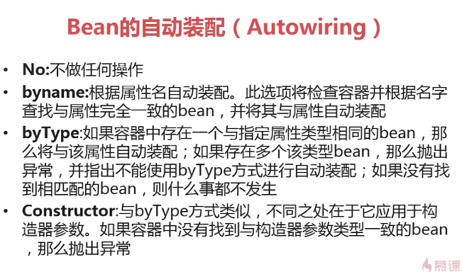

在xml中自动装配 

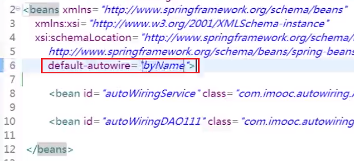


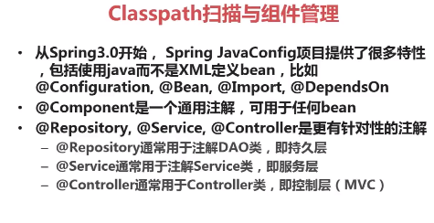

#### 注解实例

```java
//prototype每次请求都将产生新的对象
@Scope("prototype")
//使用默认的beanName  myComponent
//也可以指定名称
@Component
public class MyComponent {
	public void fight(String name){
		System.out.println("嬴政 VS "+name);
		System.out.println("嬴政使用二技能,试图减速"+name+"的突进");
		System.out.println(name+"走位走位,躲过了,并且发出大招");
		System.out.println("嬴政危机时刻,闪现避退了"+name+"的大招");
		System.out.println(name+"再次靠近,发起攻击");
		System.out.println("嬴政更好大招解锁完毕,释放大招");
		System.out.println("随着无数的剑芒扫射而来,"+name+"被虐杀");
		System.out.println("嬴政胜");
	}
}
/**
 * autowire可用于
 *      属性
 *      setter
 *      构造器
 */
@Service("heroService")
public class HeroServiceImpl implements HeroService {

	@Autowired(required = false)
	private HeroRepository heroRepository;

	@Override
	public void fight(Hero hero, List<Hero> heroes, int skill) {
		heroRepository.fight(hero,heroes,skill);
	}
}


```


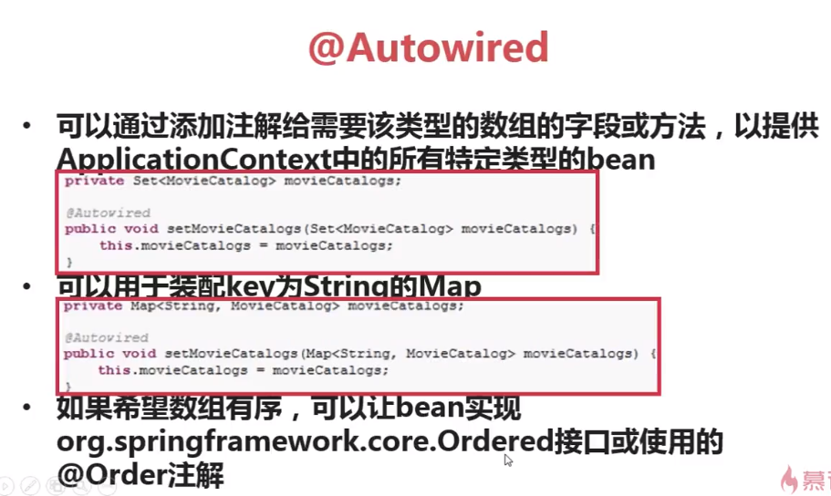

## 2. bean 的生命周期

### 2.1 bean容器初始化

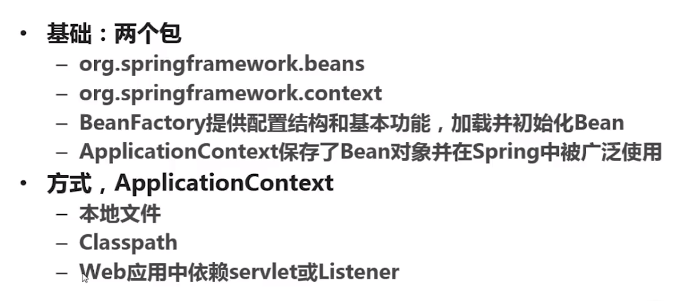

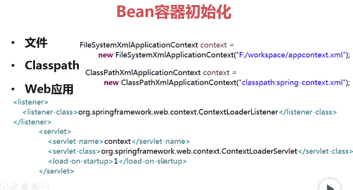

### 2.2 bean配置项

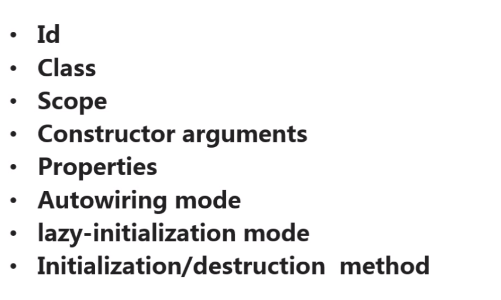

#### 2.2.1 作用域--Scope

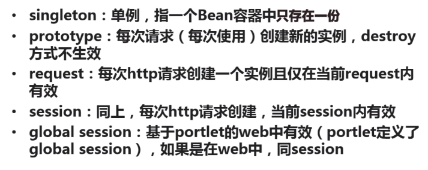

### 2.3 Bean的生命周期

- 定义
- 初始化
- 使用
- 销毁

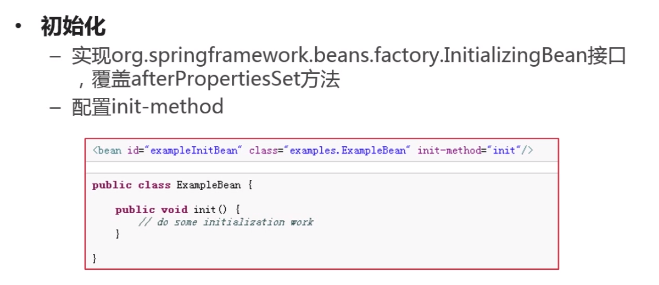

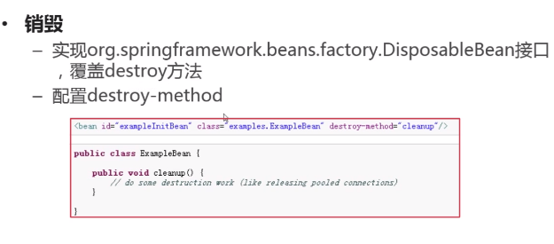


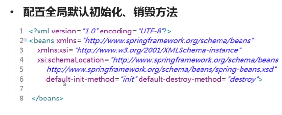

##### note

> 优先级: 实现>bean配置>全局默认配置

> 一旦使用了 实现或者bean配置,那么全局默认配置将不再生效

> 全局默认配置是可选的方法,其他两种不可以没有

### 2.4 Aware

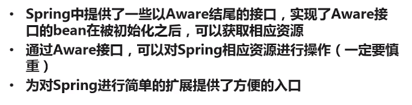

### 2.5 Resource--获取资源文件

> 所有的ApplicationContext都实现了ResourceLoader

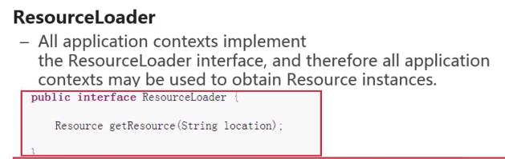

```java
String path="";
Resource res=ctx=getResource(path);
res.getFileName();
res.contentLength();
```

>下面的注意`\`,`/`,file的时候使用`\\`

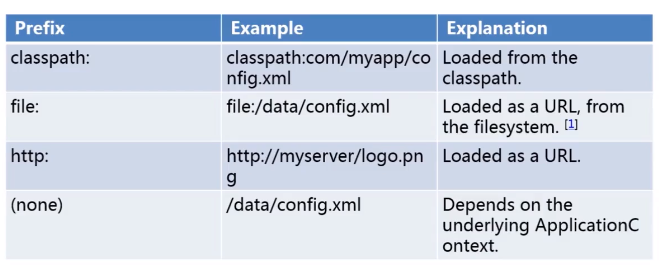

如果path前面是空,如(`config.txt`) ,那么 将applicationContext的路径作为目标路径


