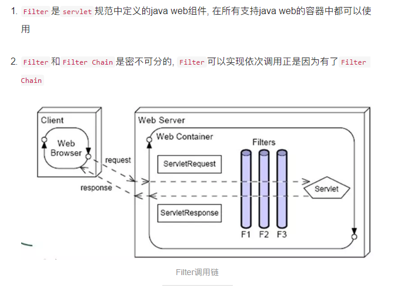
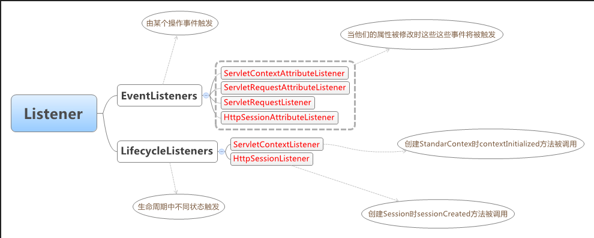

# BASIC

## 1. filter,listener,interceptor



### 1.1 filter的功能

filter功能，它使用户可以改变一个 request和修改一个response. Filter 不是一个servlet,它不能产生一个response,它能够在一个request到达servlet之前预处理request,也可以在离开 servlet时处理response.换种说法,filter其实是一个”servlet chaining”(servlet 链).

一个Filter包括：

1）、在servlet被调用之前截获;
2）、在servlet被调用之前检查servlet request;
3）、根据需要修改request头和request数据;
4）、根据需要修改response头和response数据;
5）、在servlet被调用之后截获.

 服务器每次只调用setFilterConfig方法一次准备filter 的处理;调用doFilter方法多次以处理不同的请求.FilterConfig接口有方法可以找到filter名字及初始化参数信息.服务器可以设置 FilterConfig为空来指明filter已经终结。

每一个filter从doFilter()方法中得到当前的request及response.在这个方法里,可以进行任何的针对request及 response的操作.(包括收集数据,包装数据等).filter调用chain.doFilter()方法把控制权交给下一个filter.一个 filter在doFilter()方法中结束.如果一个filter想停止request处理而获得对response的完全的控制,那它可以不调用下 一个filter

例子：

首先新建一个Filter
```java
/**
 * 
    */
    package com.ee.filter;

import java.io.IOException;

import javax.servlet.Filter;
import javax.servlet.FilterChain;
import javax.servlet.FilterConfig;
import javax.servlet.ServletException;
import javax.servlet.ServletRequest;
import javax.servlet.ServletResponse;

/**
 * @author Administrator
    *
     */
    public class LogFilter implements Filter {
    private FilterConfig filterConfig;

    public FilterConfig getFilterConfig() {
    	System.err.println("...getFilterConfig...");
    	return filterConfig;
    }

    public void setFilterConfig(FilterConfig filterConfig) {
    	System.err.println("...setFilterConfig...");
    	this.filterConfig = filterConfig;
    }

    /* (non-Javadoc)
     * @see javax.servlet.Filter#destroy()
        */
        @Override
        public void destroy() {
        System.err.println("...filter destroy...");
        }

    /* (non-Javadoc)
     * @see javax.servlet.Filter#doFilter(javax.servlet.ServletRequest, javax.servlet.ServletResponse, javax.servlet.FilterChain)
        */
        @Override
        public void doFilter(ServletRequest request, ServletResponse response,
        	FilterChain chain) throws IOException, ServletException {
        System.err.println("...doFilter...");
        chain.doFilter(request, response);//看到这没，这只要是传递下一个Filter
        }

    /* (non-Javadoc)
     * @see javax.servlet.Filter#init(javax.servlet.FilterConfig)
        */
        @Override
        public void init(FilterConfig filterConfig) throws ServletException {
        System.err.println("...init Filter...");
        this.filterConfig = filterConfig;
        }

}
```
在web.xml里配置
```xml
  <filter>
  	<filter-name>LogFilter</filter-name>
  	<filter-class>com.ee.filter.LogFilter</filter-class>
  </filter>

  <filter-mapping>
  	<filter-name>LogFilter</filter-name>
  	<url-pattern>/*</url-pattern>
  </filter-mapping>
```
启动运行

可以看到...init Filter...首先在TOMCAT启动时即被打印，然后在运行里面再看到...doFilter...被打印。

 

### 1.2 servlet功能

1．Servlet 是什么？
　　Servlet是使用Java Servlet 应用程序设计接口（API）及相关类和方法的 Java 程序。除了 Java Servlet API，Servlet 还可以使用用以扩展和添加到 API 的 Java 类软件包。Servlet 在启用 Java 的 Web 服务器上或应用服务器上运行并扩展了该服务器的能力。Java servlet对于Web服务器就好象Java applet对于Web浏览器。Servlet装入Web服务器并在Web服务器内执行，而applet装入Web浏览器并在Web浏览器内执行。Java Servlet API 定义了一个servlet 和Java使能的服务器之间的一个标准接口，这使得Servlets具有跨服务器平台的特性。
　　Servlet 通过创建一个框架来扩展服务器的能力，以提供在 Web 上进行请求和响应服务。当客户机发送请求至服务器时，服务器可以将请求信息发送给 Servlet，并让 Servlet 建立起服务器返回给客户机的响应。 当启动 Web 服务器或客户机第一次请求服务时，可以自动装入 Servlet。装入后， Servlet 继续运行直到其它客户机发出请求。Servlet 的功能涉及范围很广。例如，Servlet 可完成如下功能：
　　(1) 创建并返回一个包含基于客户请求性质的动态内容的完整的 HTML页面。
　　(2) 创建可嵌入到现有 HTML 页面中的一部分 HTML 页面（HTML 片段）。
　　(3) 与其它服务器资源（包括数据库和基于 Java 的应用程序）进行通信。
　　(4) 用多个客户机处理连接，接收多个客户机的输入，并将结果广播到多个客户机上。例如，Servlet 可以是多参与者的游戏服务器。
　　(5) 当允许在单连接方式下传送数据的情况下，在浏览器上打开服务器至applet的新连接，并将该连
接保持在打开状态。当允许客户机和服务器简单、高效地执行会话的情况下，applet也可以启动客户浏览器和服务器之间的连接。可以通过定制协议或标准（如 IIOP）进行通信。
　　(6) 对特殊的处理采用 MIME 类型过滤数据，例如图像转换和服务器端包括（SSI）。
　　(7) 将定制的处理提供给所有服务器的标准例行程序。例如，Servlet 可以修改如何认证用户。
　　2．Servlet 的生命周期
　　Servlet 的生命周期始于将它装入 Web 服务器的内存时，并在终止或重新装入 Servlet 时结束。

(1) 初始化
　　在下列时刻装入 Servlet：
　如果已配置自动装入选项，则在启动服务器时自动装入
　在服务器启动后，客户机首次向 Servlet 发出请求时
　重新装入 Servlet 时装入 Servlet 后，服务器创建一个 Servlet 实例并且调用 Servlet 的 init() 方法。在初始化阶段，Servlet 初始化参数被传递给 Servlet 配置对象。
　　(2) 请求处理
　　对于到达服务器的客户机请求，服务器创建特定于请求的一个“请求”对象和一个“响应”对象。服务器调用 Servlet 的 service() 方法，该方法用于传递“请求”和“响应”对象。service() 方法从“请求”对象获得请求信息、处理该请求并用“响应”对象的方法以将响应传回客户机。service() 方法可以调用其它方法来处理请求，例如 doGet()、doPost() 或其它的方法。
　　(3) 终止
　　当服务器不再需要 Servlet, 或重新装入 Servlet 的新实例时，服务器会调用 Servlet 的 destroy() 方法。

  　　3. Java Servlet API
      Java Servlet 开发工具（JSDK）提供了多个软件包，在编写 Servlet 时需要用到这些软件包。其中包括两个用于所有 Servlet 的基本软件包：javax.servlet 和 javax.servlet.http。可从sun公司的Web站点下载 Java Servlet 开发工具。 下面主要介绍javax.servlet.http提供的HTTP Servlet应用编程接口。
      　　HTTP Servlet 使用一个 HTML 表格来发送和接收数据。要创建一个 HTTP Servlet，请扩展 HttpServlet 类， 该类是用专门的方法来处理 HTML 表格的 GenericServlet 的一个子类。 HTML 表单是由 <FORM> 和 </FORM> 标记定义的。表单中典型地包含输入字段（如文本输入字段、复选框、单选按钮和选择列表）和用于提交数据的按钮。当提交信息时，它们还指定服务器应执行哪一个Servlet（或其它的程序）。 HttpServlet 类包含 init()、destroy()、service() 等方法。其中 init() 和 destroy() 方法是继承的。
      　　(1) init() 方法
      　　在 Servlet 的生命期中，仅执行一次 init() 方法。它是在服务器装入 Servlet 时执行的。 可以配置服务器，以在启动服务器或客户机首次访问 Servlet 时装入 Servlet。 无论有多少客户机访问 Servlet，都不会重复执行 init() 。
      　　缺省的 init() 方法通常是符合要求的，但也可以用定制 init() 方法来覆盖它，典型的是管理服务器端资源。 例如，可能编写一个定制 init() 来只用于一次装入 GIF 图像，改进 Servlet 返回 GIF 图像和含有多个客户机请求的性能。另一个示例是初始化数据库连接。缺省的 init() 方法设置了 Servlet 的初始化参数，并用它的 ServletConfig 对象参数来启动配置， 因此所有覆盖 init() 方法的 Servlet 应调用 super.init() 以确保仍然执行这些任务。在调用 service() 方法之前，应确保已完成了 init() 方法。
      　　(2) service() 方法
      　　service() 方法是 Servlet 的核心。每当一个客户请求一个HttpServlet 对象，该对象的service() 方法就要被调用，而且传递给这个方法一个“请求”（ServletRequest）对象和一个“响应”（ServletResponse）对象作为参数。 在 HttpServlet 中已存在 service() 方法。缺省的服务功能是调用与 HTTP 请求的方法相应的 do 功能。例如， 如果 HTTP 请求方法为 GET，则缺省情况下就调用 doGet() 。Servlet 应该为 Servlet 支持的 HTTP 方法覆盖 do 功能。因为 HttpServlet.service() 方法会检查请求方法是否调用了适当的处理方法，不必要覆盖 service() 方法。只需覆盖相应的 do 方法就可以了。
      　当一个客户通过HTML 表单发出一个HTTP POST请求时，doPost（）方法被调用。与POST请求相关的参数作为一个单独的HTTP 请求从浏览器发送到服务器。当需要修改服务器端的数据时，应该使用doPost()方法。
      　当一个客户通过HTML 表单发出一个HTTP GET请求或直接请求一个URL时，doGet()方法被调用。与GET请求相关的参数添加到URL的后面，并与这个请求一起发送。当不会修改服务器端的数据时，应该使用doGet()方法。
      　　Servlet的响应可以是下列几种类型：
      　　一个输出流，浏览器根据它的内容类型（如text/HTML）进行解释。
      　　一个HTTP错误响应, 重定向到另一个URL、servlet、JSP。
      　　(3) destroy() 方法
      　　destroy() 方法仅执行一次，即在服务器停止且卸装Servlet 时执行该方法。典型的，将 Servlet 作为服务器进程的一部分来关闭。缺省的 destroy() 方法通常是符合要求的，但也可以覆盖它，典型的是管理服务器端资源。例如，如果 Servlet 在运行时会累计统计数据，则可以编写一个 destroy() 方法，该方法用于在未装入 Servlet 时将统计数字保存在文件中。另一个示例是关闭数据库连接。
      当服务器卸装 Servlet 时，将在所有 service() 方法调用完成后，或在指定的时间间隔过后调用 destroy() 方法。一个Servlet 在运行service() 方法时可能会产生其它的线程，因此请确认在调用 destroy() 方法时，这些线程已终止或完成。
      　　(4) GetServletConfig（）方法
      　　GetServletConfig（）方法返回一个 ServletConfig 对象，该对象用来返回初始化参数和　　ServletContext。ServletContext 接口提供有关servlet 的环境信息。
      　　(5) GetServletInfo（）方法
      　　GetServletInfo（）方法是一个可选的方法，它提供有关servlet 的信息，如作者、版本、版权。
      　　当服务器调用sevlet 的Service（）、doGet（）和doPost（）这三个方法时，均需要 “请求”和“响应”对象作为参数。“请求”对象提供有关请求的信息，而“响应”对象提供了一个将响应信息返回给浏览器的一个通信途径。javax.servlet 软件包中的相关类为ServletResponse和ServletRequest，而javax.servlet.http 软件包中的相关类为HttpServletRequest 和 HttpServletResponse。Servlet 通过这些对象与服务器通信并最终与客户机通信。Servlet 能通过调用“请求”对象的方法获知客户机环境，服务器环境的信息和所有由客户机提供的信息。Servlet 可以调用“响应”对象的方法发送响应，该响应是准备发回客户机的。

 

例子：

创建一个servlet
```java
/**
 * 
    */
    package com.ee.servlet;

import java.io.IOException;

import javax.servlet.ServletException;
import javax.servlet.http.HttpServlet;
import javax.servlet.http.HttpServletRequest;
import javax.servlet.http.HttpServletResponse;

/**
 * @author Administrator
    *
     */
    public class LogServlet extends HttpServlet {

    /**
     * 
        */
        private static final long serialVersionUID = 1L;

    @Override
    protected void doGet(HttpServletRequest req, HttpServletResponse resp)
    		throws ServletException, IOException {
    	doPost(req, resp);
    }

    @Override
    protected void doPost(HttpServletRequest req, HttpServletResponse resp)
    		throws ServletException, IOException {
    	System.err.println("...doPost(req, resp)...");
    }
    }
```

在web.xml中的配置：
```xml
  <servlet>
  	<servlet-name>LogServlet</servlet-name>
  	<servlet-class>com.ee.servlet.LogServlet</servlet-class>
  </servlet>

  <servlet-mapping>
  	<servlet-name>LogServlet</servlet-name>
  	<url-pattern>/*</url-pattern><!-- 看到此没有，这个拦截所有路径 -->
  </servlet-mapping>
```
它的拦截规则：

当一个请求发送到servlet容器的时候，容器先会将请求的url减去当前应用上下文的路径作为servlet的映射url，比如我访问的是http://localhost/test/aaa.html，我的应用上下文是test，容器会将http://localhost/test去掉，剩下的/aaa.html部分拿来做servlet的映射匹配。这个映射匹配过程是有顺序的，而且当有一个servlet匹配成功以后，就不会去理会剩下的servlet了（filter不同，后文会提到）。其匹配规则和顺序如下：

1.     精确路径匹配。例子：比如servletA 的url-pattern为 /test，servletB的url-pattern为 /* ，这个时候，如果我访问的url为http://localhost/test ，这个时候容器就会先 进行精确路径匹配，发现/test正好被servletA精确匹配，那么就去调用servletA，也不会去理会其他的servlet了。

2.     最长路径匹配。例子：servletA的url-pattern为/test/*，而servletB的url-pattern为/test/a/*，此时访问http://localhost/test/a时，容器会选择路径最长的servlet来匹配，也就是这里的servletB。

3.     扩展匹配，如果url最后一段包含扩展，容器将会根据扩展选择合适的servlet。例子：servletA的url-pattern：*.action

4.     如果前面三条规则都没有找到一个servlet，容器会根据url选择对应的请求资源。如果应用定义了一个default servlet，则容器会将请求丢给default servlet

 

 

### 1.3 Listener功能

它是基于观察者模式设计的，Listener 的设计对开发 Servlet 应用程序提供了一种快捷的手段，能够方便的从另一个纵向维度控制程序和数据。目前 Servlet 中提供了 5 种两类事件的观察者接口，它们分别是：4 个 EventListeners 类型的，ServletContextAttributeListener、ServletRequestAttributeListener、ServletRequestListener、HttpSessionAttributeListener 和 2 个 LifecycleListeners 类型的，ServletContextListener、HttpSessionListener。如下图所示：



 

Listener是Servlet的监听器，它可以监听客户端的请求、服务端的操作等。通过监听器，可以自动激发一些操作，比如监听在线的用户的数量。当增加一个HttpSession时，就激发sessionCreated(HttpSessionEvent se)方法，这样就可以给在线人数加1。常用的监听接口有以下几个：

ServletContextAttributeListener监听对ServletContext属性的操作，比如增加、删除、修改属性。

ServletContextListener监听ServletContext。当创建ServletContext时，激发contextInitialized(ServletContextEvent sce)方法；当销毁ServletContext时，激发contextDestroyed(ServletContextEvent sce)方法。

HttpSessionListener监听HttpSession的操作。当创建一个Session时，激发session Created(HttpSessionEvent se)方法；当销毁一个Session时，激发sessionDestroyed (HttpSessionEvent se)方法。

HttpSessionAttributeListener监听HttpSession中的属性的操作。当在Session增加一个属性时，激发attributeAdded(HttpSessionBindingEvent se) 方法；当在Session删除一个属性时，激发attributeRemoved(HttpSessionBindingEvent se)方法；当在Session属性被重新设置时，激发attributeReplaced(HttpSessionBindingEvent se) 方法。

下面我们开发一个具体的例子，这个监听器能够统计在线的人数。在ServletContext初始化和销毁时，在服务器控制台打印对应的信息。当ServletContext里的属性增加、改变、删除时，在服务器控制台打印对应的信息。

要获得以上的功能，监听器必须实现以下3个接口：

HttpSessionListener

ServletContextListener

ServletContextAttributeListener

 

例子：
```java
/**
 * 
    */
    package com.ee.listener;

import javax.servlet.ServletContextAttributeEvent;
import javax.servlet.ServletContextAttributeListener;
import javax.servlet.ServletContextEvent;
import javax.servlet.ServletContextListener;
import javax.servlet.http.HttpSessionEvent;
import javax.servlet.http.HttpSessionListener;

/**
 * @author Administrator
    *
     */
    public class OnlineUserListener implements HttpSessionListener,
    	ServletContextListener, ServletContextAttributeListener {
    private long onlineUserCount = 0;

    public long getOnlineUserCount() {
    	return onlineUserCount;
    }

    /* (non-Javadoc)
     * @see javax.servlet.ServletContextAttributeListener#attributeAdded(javax.servlet.ServletContextAttributeEvent)
        */
        @Override
        public void attributeAdded(ServletContextAttributeEvent arg0) {

    }

    /* (non-Javadoc)
     * @see javax.servlet.ServletContextAttributeListener#attributeRemoved(javax.servlet.ServletContextAttributeEvent)
        */
        @Override
        public void attributeRemoved(ServletContextAttributeEvent arg0) {

    }

    /* (non-Javadoc)
     * @see javax.servlet.ServletContextAttributeListener#attributeReplaced(javax.servlet.ServletContextAttributeEvent)
        */
        @Override
        public void attributeReplaced(ServletContextAttributeEvent attributeEvent) {
        System.err.println("...attributeReplaced...");
        }

    /* (non-Javadoc)
     * @see javax.servlet.ServletContextListener#contextDestroyed(javax.servlet.ServletContextEvent)
        */
        @Override
        public void contextDestroyed(ServletContextEvent arg0) {

    }

    /* (non-Javadoc)
     * @see javax.servlet.ServletContextListener#contextInitialized(javax.servlet.ServletContextEvent)
        */
        @Override
        public void contextInitialized(ServletContextEvent arg0) {

    }

    /* (non-Javadoc)
     * @see javax.servlet.http.HttpSessionListener#sessionCreated(javax.servlet.http.HttpSessionEvent)
        */
        @Override
        public void sessionCreated(HttpSessionEvent httpSessionEvent) {
        onlineUserCount ++;
        toUpdateCount(httpSessionEvent);
        }

    /* (non-Javadoc)
     * @see javax.servlet.http.HttpSessionListener#sessionDestroyed(javax.servlet.http.HttpSessionEvent)
        */
        @Override
        public void sessionDestroyed(HttpSessionEvent httpSessionEvent) {
        onlineUserCount --;
        toUpdateCount(httpSessionEvent);
        }

    private void toUpdateCount(HttpSessionEvent httpSessionEvent){
    	httpSessionEvent.getSession().setAttribute("onlineUserCount", onlineUserCount);
    }
    }
```

Web.xml
```xml
  <listener>
  	<listener-class>com.ee.listener.OnlineUserListener</listener-class>
  </listener>
```


JSP页面：
```jsp
<%@ page language="java" contentType="text/html; charset=UTF-8"
    pageEncoding="UTF-8"%>
<!DOCTYPE html PUBLIC "-//W3C//DTD HTML 4.01 Transitional//EN" "http://www.w3.org/TR/html4/loose.dtd">
<html>
<head>
<meta http-equiv="Content-Type" content="text/html; charset=UTF-8">
<title>主页</title>
</head>
<body>
	<h4>你好！</h4>
	在线人数：<h1><%=request.getSession().getAttribute("onlineUserCount") %></h1>
</body>
</html>
```

### ### 1.4 Interceptor

1.  `Interceptor`不是`servlet`规范中的java web组件, 而是Spring提供的组件, 功能上和Filter差不多. 但是实现上和Filter不一样.

`Interceptor`功能的实现主要是在Spring Mvc的`DispatcherServelt.doDispatch`方法中, 让我们来看看源码

```
// Interceptor的源码
public interface HandlerInterceptor {

    // 在调用真正的处理请求类之前调用
    boolean preHandle(HttpServletRequest request, HttpServletResponse response, Object handler)
            throws Exception;

    // 在调用真正的处理请求类之后调用
    void postHandle(
            HttpServletRequest request, HttpServletResponse response, Object handler, ModelAndView modelAndView)
            throws Exception;

 // 在完成渲染或者出错之后调用
    void afterCompletion(
            HttpServletRequest request, HttpServletResponse response, Object handler, Exception ex)
            throws Exception;

}
// doDispatch源码(只保留关键代码)

protected void doDispatch(HttpServletRequest request, HttpServletResponse response) throws Exception {
        try {
            ModelAndView mv = null;
            Exception dispatchException = null;

            try {
                ....
                其它的处理代码
                ....
                
                // 调用拦截器的前置处理方法
                if (!mappedHandler.applyPreHandle(processedRequest, response)) {
                    return;
                }

                // Actually invoke the handler.
                // 调用真正的处理请求的方法
                mv = ha.handle(processedRequest, response, mappedHandler.getHandler());

                // 找到渲染模版
                applyDefaultViewName(processedRequest, mv);
                
                // 调用拦截器的后置处理方法
                mappedHandler.applyPostHandle(processedRequest, response, mv);
            }
            catch (Exception ex) {
                ....
                异常处理代码
                ....
        }
        finally {
            ....
            始终要执行的代码
            ....
    }
```

其实看了`doDispatch`的关键代码, Spring Mvc对整个请求的处理流程已经很清楚了:

调用拦截器的前置方法 -> 调用处理请求的方法 -> 渲染模版 -> 调用拦截器的后置处理方法 -> 调用拦截器的完成方法

接下来看一看Spring Mvc是如何实现依此调用这么多拦截器的前置方法, 后置方法, 完成方法的

进入到`mapperHandler.applyPreHandle()`方法中(调用拦截器的前置方法)

```
boolean applyPreHandle(HttpServletRequest request, HttpServletResponse response) throws Exception {
        HandlerInterceptor[] interceptors = getInterceptors();
        // 如果拦截器数组不为空
        if (!ObjectUtils.isEmpty(interceptors)) {
           // 按顺序调用拦截器数组中的preHandle方法
            for (int i = 0; i < interceptors.length; i++) {
                HandlerInterceptor interceptor = interceptors[i];
                // 如果拦截器的preHandle方法返回false, 则调用当前拦截器的triggerAfterCompletion方法, 然后返回, 并且不再调用后续的拦截器
                if (!interceptor.preHandle(request, response, this.handler)) {
                    triggerAfterCompletion(request, response, null);
                    return false;
                }
                this.interceptorIndex = i;
            }
        }
        return true;
    }
```

进入到`mappedHandler.applyPostHandle()`方法中(调用拦截器的后置方法)

```
void applyPostHandle(HttpServletRequest request, HttpServletResponse response, ModelAndView mv) throws Exception {
        HandlerInterceptor[] interceptors = getInterceptors();
        // 如果拦截器数组不为空
        if (!ObjectUtils.isEmpty(interceptors)) {
            // 倒序调用拦截器数组中拦截器的postHandle方法
            for (int i = interceptors.length - 1; i >= 0; i--) {
                HandlerInterceptor interceptor = interceptors[i];
                interceptor.postHandle(request, response, this.handler, mv);
            }
        }
    }
```

不管是否出异常`triggerAfterCompletion`方法始终会被调用

```
void triggerAfterCompletion(HttpServletRequest request, HttpServletResponse response, Exception ex)
            throws Exception {

        HandlerInterceptor[] interceptors = getInterceptors();
        // 拦截器数组不为空
        if (!ObjectUtils.isEmpty(interceptors)) {
           // 从成功执行的最后一个拦截器开始逆序调用afterCompletion方法
            for (int i = this.interceptorIndex; i >= 0; i--) {
                HandlerInterceptor interceptor = interceptors[i];
                try {
                    interceptor.afterCompletion(request, response, this.handler, ex);
                }
                catch (Throwable ex2) {
                    logger.error("HandlerInterceptor.afterCompletion threw exception", ex2);
                }
            }
        }
    }
```

看过以上三个方法之后, Spring Mvc如何处理拦截器的前置, 后置, 完成方法就一目了然了. 其实Spring Mvc就是将拦截器统一放到了拦截器数组中, 然后在调用真正的处理请求方法之前和之后正序或者倒序遍历拦截器, 同时调用拦截器的相应的方法. 最后不管是否正常结束这个流程还是出异常都会从成功的最后一个拦截器开始逆序调用`afterCompletion`方法

### #### filter---VS--interceptor

1. `Filter`是利用了方法的调用(入栈出栈)完成整个流程, 而`Interceptor`是利用了`for`循环完成了整个流程.
2.  `Filter`的实现比较占用栈空间, 在`Filter`多的情况下可能会有栈溢出的风险存在.
3.  `Interceptor`的实现逻辑更加的清晰简单
4.  `Filter`组件更加的通用, 只要支持`java servlet`的容器都可以使用, 而`Interceptor`必须依赖于Spring
5. Filter的优先级是高于`Interceptor`, 即请求是先到`Filter`再到`Interceptor`的, 因为`Interceptor`的实现主体还是一个`servlet`