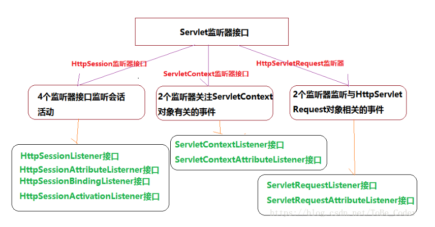

# Listener


## HttpSessionListener
HttpSessionAttributeListener（javax.servlet.http.HttpSessionAttributeListener）

此接口定义了定义了三个需要实现的方法，他们都接收HttpSessionBindingEvent类型的事件。

注：如果web应用中使用了实现该监听器接口的类，需要修改web.xml文件。与HttpSessionListener修改相同。

attributeAdded():当session对象增加属性时，Web容器会自动调用此方法。
attributeReplaced():当session对象的同名属性被替换时，Web容器会自动调用此方法。
attributeRemoved():当session对象属性被移除时，Web容器会自动调用此方法。
拓展：在HttpSessionBindingEvent类中定义了三个方法，getSession(),getName()和getValue()。getSession()方法获得当前触发事件的session对象，getName()方法获得被操作的session的属性的名字，getValue()方法获得被操作的session属性的值。

HttpSessionBindingListener（javax.servlet.http.HttpSessionBindingListener）

实现HttpSessionBindingListener接口，JavaBean 对象可以感知自己被绑定到 Session 中和从 Session 中删除的事件。

此接口中定义了两个方法，他们都接收HttpSessionBindingEvent类型的事件。

注：使用这个接口的实现类不需要配置web,xml文件，可以直接使用。

valueBound():一个类实现了此接口，则当这个类的对象通过session.setAttributr()被绑定到session对象中时，该对象的词=此方法被调用。
valueUnbound():一个类实现了此接口，则当这个类的对象从session中删除时，此方法会被自动调用。
HttpSessionActivationListener（javax.servlet.http.HttpSessionActivationListener）

实现HttpSessionActivationListener接口，JavaBean 对象可以感知自己被活化和钝化的事件。
此接口中定义了两个方法，他们都接收HttpSessionEvent类型的事件。

注：如果web应用中使用了实现该监听器接口的类，需要配置web.xml文件。

sessionDidActivate():session对象活化后由容器自动调用。
sessionWillPassivate():session对象钝化前由容器自动调用。
 说明：Activate(活化)与Passivate(钝化)是web容器为了更好的利用资源或者进行服务器负载平衡等原因而对 特定对象采取的措施。session对象的钝化指的是：session对象通过序列化的方式存储到硬盘，而会话对象的活化与钝化相反，web容器把硬盘上存储的会话对象重新加载到web容器。

ServletContext监听器接口：   

拓展：一个web应用就是由一系列的Servlet,Jsp和其他相关文件的集合，这些文件的组织采用特定的目录结构，并且会有一个web.xml文件作为配置文件。每个在web容器中运行的web应用都会有一个对应的javax.servlet.ServletContext对象。在JSP文件中这个对象化身成application对象；在Servlet中，该对象可以通过this.getServletContext()方法获取，servletContext对象在同一个应用中是共享的，它总是用来保存生命周期非常长的全局变量或者全局对象。

ServletContextListener（javax.servlet.ServletContextListener）

此接口定义两个方法：contextInitialized();    contextDestroyed();

注：此两个方法，接收ServletContextEvent类型的事件。需要配置web.xml文件。

ServletContextAttributeListener（javax.servlet.ServletContextAttributeListener）

此接口定义三个方法：addributeAdded();    attributeReplaced();     attributeRemoved();

注：此三个方法接收ServletContextAttributeEvent类型的事件。需要配置web.xml文件。

HttpServletRequest监听器接口：

ServletRequestListener（javax.servlet.HttpSessionActivationListener）

此接口定义两个方法：requestInitialized();   requestDestroyed();  

注：此两个方法，接收ServletRequestEvent类型的事件。需要配置web.xml文件。

ServletRequestAttributeListener（javax.servlet.ServletRequestAttributeListener）

此接口定义三个方法：addributeAdded();    attributeReplaced();   attributeRemoved()

注：此三个方法接收ServletRequestAttributeEvent类型的事件。需要配置web.xml文件。

说明：ServletContext和ServletRequest监听器中的接口方法，与HttpSession监听器中（HttpSessionLister和HttpSessionAttributeListener）的方法调用时机一致，因此不进行赘述。

应用Demo：

HttpSessionListener：收集在线者信息
```java
package webbook;
 
import javax.servlet.http.HttpSessionEvent;
import javax.servlet.http.HttpSessionListener;
 
public class CounterListener implements HttpSessionListener {
 
	private static long onlineNumber=0;
	public static long getOnlineNumber(){
		return onlineNumber;
	}
	@Override
	public void sessionCreated(HttpSessionEvent arg0) {
		onlineNumber++;
		
	}
 
	@Override
	public void sessionDestroyed(HttpSessionEvent arg0) {
		onlineNumber--;
	}
 
}
```
在web.xml中加入配置：
```xml
<listener>
  	<listener-class>webbook.CounterListener</listener-class>
</listener>
```
访问页面：
```html
<%@ page language="java" import="java.util.*" pageEncoding="UTF-8"%>
<%@ page import="webbook.CounterListener" %>  <!-- 指示当前类所要使用的类 -->
<%
String path = request.getContextPath();
String basePath = request.getScheme()+"://"+request.getServerName()+":"+request.getServerPort()+path+"/";
%>

<!DOCTYPE HTML PUBLIC "-//W3C//DTD HTML 4.01 Transitional//EN">
<html>
  <head>
    <base href="<%=basePath%>">
    
    <title>web应用在线人数监听</title>
 
  </head>
  
  <body>
  当前应用中有<%= CounterListener.getOnlineNumber() %>人在线
  </body>
</html>
```