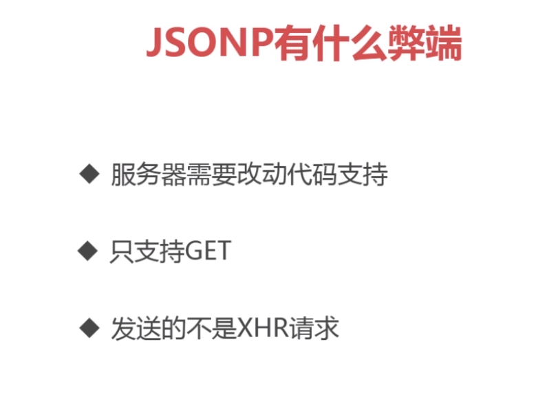

# Basic

## 1. Session

### 1.1 三种`getSession`

```java
//下面两种用法相同
//如果没有session,会创建一个新的session---适合存取登录信息
HttpServletRequest.getSession();
HttpServletRequest.getSession(ture);

//如果没有session,会返回null
HttpServletRequest.getSession(false);
```

## 2. 跨域

### 2.1 跨域产生的原因

1. 发送的是XHR(XMLHttpRequest)请求
2. 浏览器限制(浏览器会做校验)
3. 跨域(协议,端口,域名任何一个不是本域的都会产生跨域)

### 2.2 解决思路

1. 浏览器限制--可以设置浏览器启动方式,可以用,但是没有意义
2. 针对XHR,可以采用JSONP(**目前JSONP有很多缺点,并不适用**)
3. 跨域--最终解决方案


#### 2.2.1 跨域解决思路

>  - 被调用方(服务端)
>  - 调用方(客户端)


## 3. 解决方法

### 3.1  浏览器  命令行启动

`chrome --disable-web-security --user-data-dir=g:\temp3`

### 3.2 JSONP
JSONP使用的时候
前端后端都需要改变

#### 3.2.1 JSONP的特点
1.发送的Content-type javaScript
2.发送请求的url跟了一长串.避免发生缓存
3.返回的是一个javaScript对象.而不是json数据
4.指定callback参数名,前后端要一致

#### 3.2.2 JSONP的弊端


#### 3.2.3 JSONP的后端修改方式
使用@ControllerAdvice注解一个类,
继承于`AbstractJsonpResponseBodyAdvice`
```java
@ControllerAdvice
public class JsonpAdvice extends AbstractJsonpResponseBodyAdvice {

	public JsonpAdvice() {
		// TODO Auto-generated constructor stub
		super("callback2");
	}
}

```
#### 3.2.4 前端修改方式
1.使用jq发送的普通的Ajax请求
```js
$.getJSON(baseUrl+"/get1").then(function(jsonObj){
    console.log(jsonObj);
})
```
2.使用jq发送的普通的JSONP请求
```js
$.ajax({
    url:baseUrl+"/get1",
    dataType:"jsonp",
    cache:true,
    success:function(json){
        result=json;
    }
})
```


### 跨域
1.服务器支持跨域
2.前端隐藏跨域


### 3.3 被调用方解决跨域
1.filter
2.nginx
3.apache

#### 3.3.1 filter
```java
package com.imooc;

import javax.servlet.*;
import javax.servlet.http.HttpServletRequest;
import javax.servlet.http.HttpServletResponse;
import java.io.IOException;

public class CrosFilter implements Filter {

	@Override
	public void init(FilterConfig filterConfig) throws ServletException {
		// TODO Auto-generated method stub

	}

	@Override
	public void doFilter(ServletRequest request, ServletResponse response, FilterChain chain)
			throws IOException, ServletException {
		// TODO Auto-generated method stub

		HttpServletResponse res = (HttpServletResponse) response;
		
		HttpServletRequest req = (HttpServletRequest) request;
		
		String origin = req.getHeader("Origin");
		
		if (!org.springframework.util.StringUtils.isEmpty(origin)) {
			//带cookie的时候，origin必须是全匹配，不能使用*
			res.addHeader("Access-Control-Allow-Origin", origin);			
		}
		
		res.addHeader("Access-Control-Allow-Methods", "*");
		
		String headers = req.getHeader("Access-Control-Request-Headers");
		
		// 支持所有自定义头
		if (!org.springframework.util.StringUtils.isEmpty(headers)) {
			res.addHeader("Access-Control-Allow-Headers", headers);			
		}
		
		res.addHeader("Access-Control-Max-Age", "3600");
		
		// enable cookie
		res.addHeader("Access-Control-Allow-Credentials", "true");
		
		chain.doFilter(request, response);
	}

	@Override
	public void destroy() {
		// TODO Auto-generated method stub

	}

}

//注入这个bean


/**
* 增加过滤器
* @return
*/
@Bean
public FilterRegistrationBean registerFilter() {

FilterRegistrationBean bean = new FilterRegistrationBean();

bean.addUrlPatterns("/*");
bean.setFilter(new CrosFilter());

return bean ;
}
```


### nginx配置
if后面要带空格


使用 nginx.exe -t 检查参数是否正确


