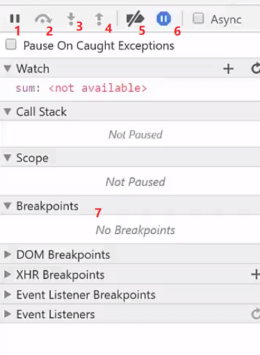
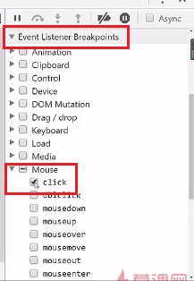

# 浏览器
## 1. 浏览器调试代码

### 1.1 调试css/html代码

### 1.2 调试js代码

在source中进行调试

ctrl shift f==全局搜索

ctrl p ==搜索文件

| 编号 | 描述                       |
| ---- | -------------------------- |
| 1    | 恢复执行                   |
| 2    | 执行下一行                 |
| 3    | 进入方法                   |
| 4    | 跳出方法                   |
| 5    | 挂起断点                   |
| 6    | 捕获异常--有异常的时候暂停 |
| 7    | 展示断点,可以挂起,清除     |

事件监听

通过上面的方式,在单击时,就会跳到对应的代码处

## 2. 浏览器bug
### 2.1 chrome下载文件损坏,qq正常

解决方法:解除文件绑定

