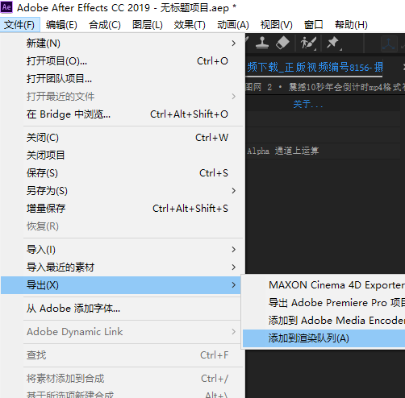
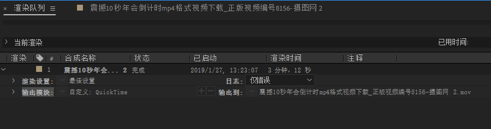
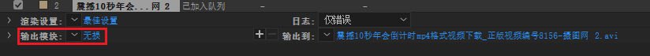
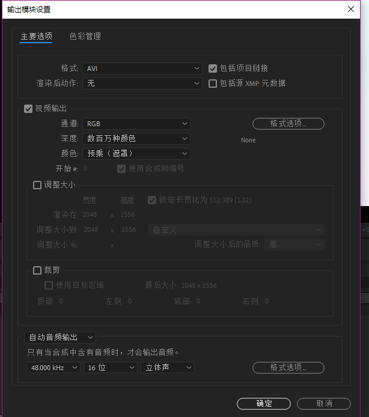
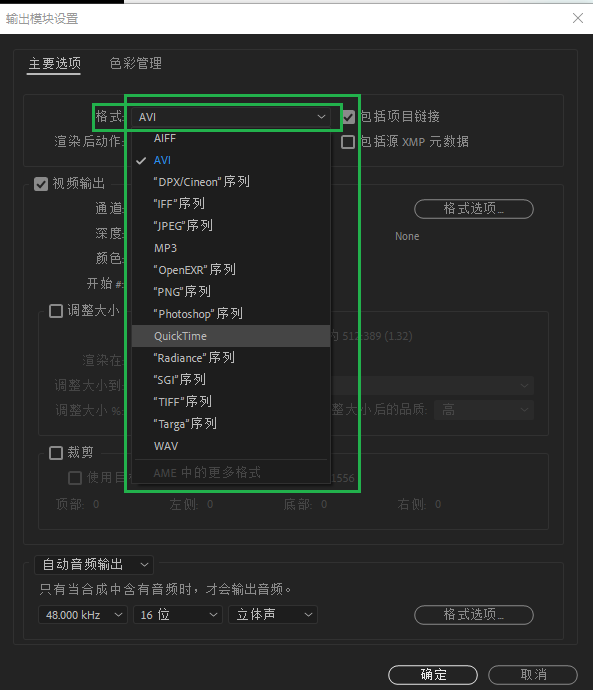
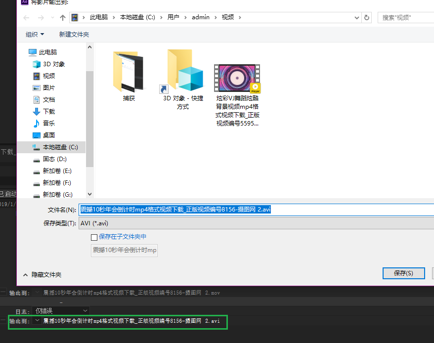
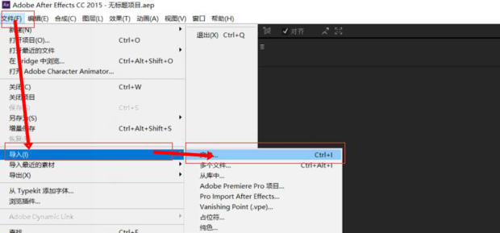

# Adobe Effect
## 1. 基础
### 1.1 导出

导出设置

#### 设置输出格式

#### 设置输出路径

### 1.2 去水印

http://xinzhi.wenda.so.com/a/1546674640202581

####1.2.1 导入

- 打开AE，在上方工具栏选择【文件】—【导入】—【文件】

  

- 2

  选择要去水印的视频文件，导入

  

- 3

  文件进入上方项目栏，鼠标按住向下拖动

  

- 4

  拖动到下方编辑栏

  

- 5

  右上方可预览视频，现欲将该水印在整个视频都去掉

  

#### 1.2.2 去水印

- 6

  点击下方编辑栏的视频素材，按“ctrl”+“D”复制一层

  

- 7

  在编辑栏的空白处点击右键，选择【新建】—【纯色】

  

- 8

  选择黑色的纯色层，确定

  

- 9

  点击纯色层，然后在上方工具栏选择【矩形工具】

  

- 10

  在预览视频中拖动矩形到刚好遮住水印

  

- 11

  这时纯色层会建立这个蒙版，点击下拉蒙版菜单

  

- 12

  在【蒙版羽化】中输入38，回车

  

- 13

  在【蒙版扩展】输入8，回车

  

- 14

  蒙版已变成这样

  

- 15

  在中间的视频层，选择【轨道遮罩】—【Alpha反转遮罩】

  

- 16

  右键点击最下面的视频层，选择【效果】—【杂色和颗粒】—【中间值】

  

- 17

  在上方效果控件找到该效果，输入38，回车

  

- 18

  AE去掉了视频的水印

  

#### 1.2.3 设置合成

