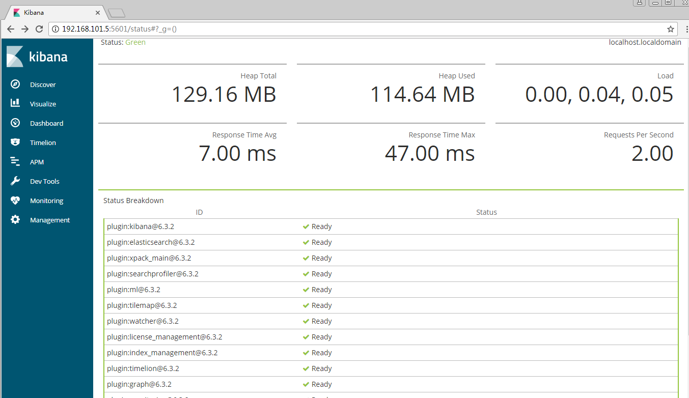
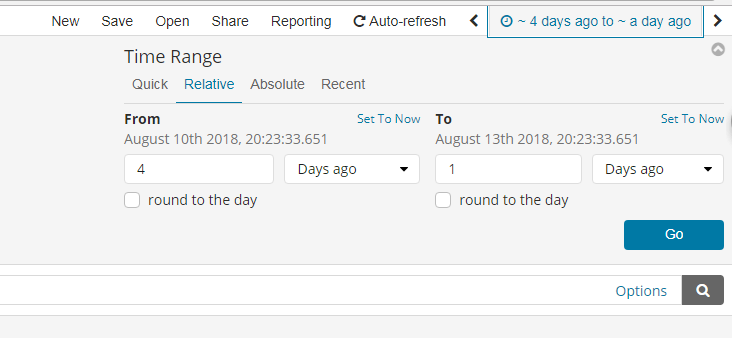
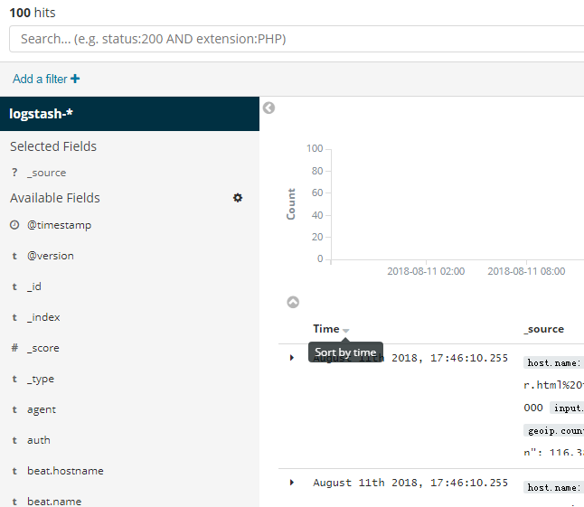
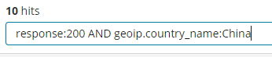
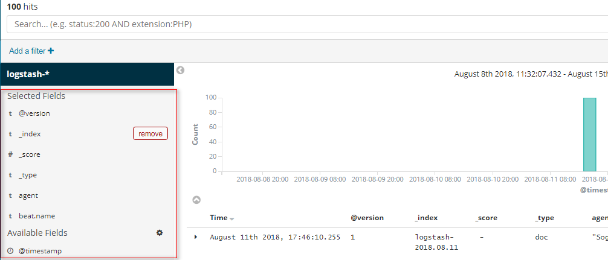
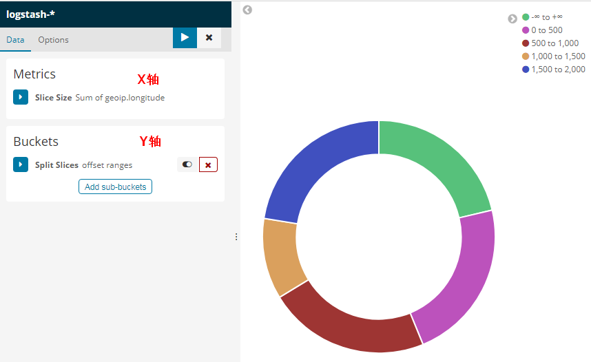

# ELK

https://www.cnblogs.com/cjsblog/p/9476813.html

Kibana是一个开源的分析和可视化平台，设计用于和Elasticsearch一起工作。

你用Kibana来搜索，查看，并和存储在Elasticsearch索引中的数据进行交互。

你可以轻松地执行高级数据分析，并且以各种图标、表格和地图的形式可视化数据。

Kibana使得理解大量数据变得很容易。它简单的、基于浏览器的界面使你能够快速创建和共享动态仪表板，实时显示Elasticsearch查询的变化。

**1.  安装Kibana**

------

 


 

**2.  Kibana配置**

------

 https://www.elastic.co/guide/en/kibana/current/settings.html

 

**3.  访问Kibana**

------

 Kibana是一个Web应用程序，你可以通过5601来访问它。例如：localhost:5601 或者 http://YOURDOMAIN.com:5601

当访问Kibana时，默认情况下，Discover页面加载时选择了默认索引模式。时间过滤器设置为最近15分钟，搜索查询设置为match-all(\*)

 

**3.1.  检查Kibana状态**

http://localhost:5601/status



或者 http://192.168.101.5:5601/api/status 返回JSON格式状态信息

 

**4.  用Elasticsearch连接到Kibana**

------

 在你开始用Kibana之前，你需要告诉Kibana你想探索哪个Elasticsearch索引。第一次访问Kibana是，系统会提示你定义一个索引模式以匹配一个或多个索引的名字。

（提示：默认情况下，Kibana连接允许在localhost上的Elasticsearch实例。为了连接到一个不同的Elasticsearch实例，修改kabana.yml中Elasticsearch的URL，然后重启Kibana。）

为了配置你想要用Kibana访问的Elasticsearch索引：

　　1、访问Kibana UI。例如，localhost:56011 或者 http://YOURDOMAIN.com:5601

　　2、指定一个索引模式来匹配一个或多个你的Elasticsearch索引。当你指定了你的索引模式以后，任何匹配到的索引都将被展示出来。

　　（画外音：*匹配0个或多个字符；  指定索引默认是为了匹配索引，确切的说是匹配索引名字）

　　3、点击“**Next Step**”以选择你想要用来执行基于时间比较的包含timestamp字段的索引。如果你的索引没有基于时间的数据，那么选择“**I don’t want to use the Time Filter**”选项。

　　4、点击“**Create index pattern**”按钮来添加索引模式。第一个索引模式自动配置为默认的索引默认，以后当你有多个索引模式的时候，你就可以选择将哪一个设为默认。（提示：Management > Index Patterns）


现在，Kibana已经连接到你的Elasticsearch数据。Kibana展示了一个只读的字段列表，这些字段是匹配到的这个索引配置的字段。

 

**5.  Discover**

------

你可以从Discover页面交互式的探索你的数据。你可以访问与所选择的索引默认匹配的每个索引中的每个文档。你可以提交查询请求，过滤搜索结构，并查看文档数据。你也可以看到匹配查询请求的文档数量，以及字段值统计信息。如果你选择的索引模式配置了time字段，则文档随时间的分布将显示在页面顶部的直方图中。


 

**5.1.  设置时间过滤**




**5.2.  搜索数据**

你可以在搜索框中输入查询条件来查询当前索引模式匹配的索引。在查询的时候，你可以使用Kibana标准的查询语言（基于Lucene的查询语法）或者完全基于JSON的Elasticsearch查询语言DSL。Kibana查询语言可以使用自动完成和简化的查询语法作为实验特性，您可以在查询栏的“选项”菜单下进行选择。

当你提交一个查询请求时，直方图、文档表和字段列表都会更新，以反映搜索结果。命中（匹配到的文档）总数会显示在工具栏中。文档表格中显示了前500个命中。默认情况下，按时间倒序排列，首先显示最新的文档。你可以通过点击“Time”列来逆转排序顺序。




 

**5.2.1.  Lucene查询语法**

Kibana查询语言基于Lucene查询语法。下面是一些提示，可能会帮到你：

- 为了执行一个文本搜索，可以简单的输入一个文本字符串。例如，如果你想搜索web服务器的日志，你可以输入关键字"**safari**"，这样你就可以搜索到所有有关"safari"的字段
- 为了搜索一个特定字段的特定值，可以用字段的名称作为前缀。例如，你输入"**status:200**"，将会找到所有status字段的值是200的文档
- 为了搜索一个范围值，你可以用括号范围语法，**[START_VALUE TO END_VALUE]**。例如，为了找到状态码是4xx的文档，你可以输入**status:[400 TO 499]**
- 为了指定更改复杂的查询条件，你可以用布尔操作符 **AND** , **OR** , 和 **NOT**。例如，为了找到状态码是4xx并且extension字段是php或者html的文档，你可以输入**status:[400 TO 499] AND (extension:php OR extension:html)**




**5.2.2.  Kibana查询语法增强**

**新的更简单的语法**

如果你熟悉Kibana的旧Lucene查询语法，那么你应该对这种新的语法也不会陌生。基本原理保持不变，我们只是简单地改进了一些东西，使查询语言更易于使用。

response:200 将匹配response字段的值是200的文档

用引号引起来的一段字符串叫短语搜索。例如，message:"Quick brown fox"  将在message字段中搜索"quick brown fox"这个短语。如果没有引号，将会匹配到包含这些词的所有文档，而不管它们的顺序如何。这就意味着，会匹配到"Quick brown fox"，而不会匹配"quick fox brown"。（画外音：引号引起来作为一个整体）

查询解析器将不再基于空格进行分割。多个搜索项必须由明确的布尔运算符分隔。注意，布尔运算符不区分大小写。

在Lucene中，response:200 extension:php 等价于 response:200 and extension:php。这将匹配response字段值匹配200并且extenion字段值匹配php的文档。

如果我们把中间换成or，那么response:200 or extension:php将匹配response字段匹配200 或者 extension字段匹配php的文档。

默认情况下，and 比 or 具有更高优先级。

response:200 and extension:php or extension:css 将匹配response是200并且extension是php，或者匹配extension是css而response任意

括号可以改变这种优先级

response:200 and (extension:php or extension:css) 将匹配response是200并且extension是php或者css的文档

还有一种简写的方式：

response:(200 or 404) 将匹配response字段是200或404的文档。字符值也可以是多个，比如：tags:(success and info and security)

还可以用not

not response:200 将匹配response不是200的文档

response:200 and not (extension:php or extension:css) 将匹配response是200并且extension不是php也不是css的文档

范围检索和Lucene有一点点不同

代替 byte:>1000，我们用byte > 1000

\>, >=, <, <= 都是有效的操作符

response:*  将匹配所有存在response字段的文档

通配符查询也是可以的。machine.os:win* 将匹配machine.os字段以win开头的文档，像"windows 7"和"windows 10"这样的值都会被匹配到。

通配符也允许我们一次搜索多个字段，例如，假设我们有machine.os和machine.os.keyword两个字段，我们想要搜索这两个字段都有"windows 10"，那么我们可以这样写"machine.os*:windows 10"

**5.2.3.  刷新搜索结果**


 **5.3.  按字段过滤**




以上是控制列表显示哪些字段，还有一种方式是在查看文档数据的时候点那个像书一样的小图标


 

删除也是可以的


我们还可以编辑一个DSL查询语句，用于过滤筛选，例如


 

**5.4.  查看文档数据**


 

**5.5.  查看文档上下文**


 

**5.6.  查看字段数据统计**


 

**6.  Visualize**

------

 Visualize使得你可以创建在你的Elasticsearch索引中的数据的可视化效果。然后，你可以构建dashboard来展示相关可视化。

Kibana可视化是基于Elasticsearch查询的。通过用一系列的Elasticsearch聚集来提取并处理你的数据，你可以创建图片来线上你需要了解的趋势、峰值和低点。

**6.1.  创建一个可视化**

为了创建一个可视化的视图：

第1步：点击左侧导航条中的“**Visualize**”按钮

第2步：点击“Create new visualization”按钮或者**加号(+)**按钮

第3步：选择一个可视化类型

第4步：指定一个搜索查询来检索可视化数据

第5步：在可视化的构建器中选择Y轴的聚合操作。例如，sum，average，count等等

第6步：设置X轴

例如：




 

更多请看这里

https://www.elastic.co/guide/en/kibana/current/createvis.html

https://www.elastic.co/guide/en/kibana/current/xy-chart.html

https://www.elastic.co/guide/en/kibana/current/visualize.html

 

**7.  Dashboard**

------

 Kibana仪表板显示可视化和搜索的集合。你可以安排、调整和编辑仪表板内容，然后保存仪表板以便共享它。

**7.1.  构建一个Dashboard**

第1步：在导航条上点击“**Dashboard**”

第2步：点击“Create new dashboard”或者“加号(+)”按钮

第3步：点击“Add”按钮

第4步：为了添加一个可视化，从可视化列表中选择一个，或者点击“Add new visualization”按钮新创建一个

第5步：为了添加一个已保存的查询，点击“Saved Search”选项卡，然后从列表中选择一个

第6步：当你完成添加并且调整了dashboard的内容后，去顶部菜单栏，点击“Save”，然后输入一个名字。

默认情况下，Kibana仪表板使用浅色主题。要使用深色主题，单击“选项”并选择“使用深色主题”。要将dark主题设置为默认，请转到管理>Management > Advanced ，并将dashboard:defaultDarkTheme设置为On。


 

**8.  Monitoring**

------

 

```
Elasticsearch控制台打印日志
[2018-08-15T14:48:26,874][INFO ][o.e.c.m.MetaDataCreateIndexService] [Px524Ts] [.monitoring-kibana-6-2018.08.15] creating index, cause [auto(bulk api)], templates [.monitoring-kibana], shards [1]/[0], mappings [doc]

Kibana控制台打印日志
log   [03:26:53.605] [info][license][xpack] Imported license information from Elasticsearch for the [monitoring] cluster: mode: basic | status: active
```


https://www.elastic.co/guide/en/kibana/current/elasticsearch-metrics.html

 

**9.  其它相关**

------

 《[Logstash](https://www.cnblogs.com/cjsblog/p/9459781.html)》

《[Elasticsearch](https://www.cnblogs.com/cjsblog/p/9439331.html)》

## Kibana常用配置及功能


##  配置 Kibana[编辑](https://github.com/elasticsearch-cn/kibana/edit/cn/docs/setup/settings.asciidoc)

Kibana server 启动时从 `kibana.yml` 文件中读取配置属性。Kibana 默认配置 `localhost:5601` 。改变主机和端口号，或者连接其他机器上的 Elasticsearch，需要更新 `kibana.yml` 文件。也可以启用 SSL 和设置其他选项。

**Kibana 配置项**

- **`server.port:`**

  **默认值: 5601** Kibana 由后端服务器提供服务，该配置指定使用的端口号。

- **`server.host:`**

  **默认值: "localhost"** 指定后端服务器的主机地址。

- **`server.basePath:`**

  如果启用了代理，指定 Kibana 的路径，该配置项只影响 Kibana 生成的 URLs，转发请求到 Kibana 时代理会移除基础路径值，该配置项不能以斜杠 (`/`)结尾。

- **`server.maxPayloadBytes:`**

  **默认值: 1048576** 服务器请求的最大负载，单位字节。

- **`server.name:`**

  **默认值: "您的主机名"** Kibana 实例对外展示的名称。

- **`server.defaultRoute:`**

  **默认值: "/app/kibana"** Kibana 的默认路径，该配置项可改变 Kibana 的登录页面。

- **`elasticsearch.url:`**

  **默认值: "http://localhost:9200"** 用来处理所有查询的 Elasticsearch 实例的 URL 。

- **`elasticsearch.preserveHost:`**

  **默认值: true** 该设置项的值为 true 时，Kibana 使用 *server.host* 设定的主机名，该设置项的值为 *false*时，Kibana 使用主机的主机名来连接 Kibana 实例。

- **`kibana.index:`**

  **默认值: ".kibana"** Kibana 使用 Elasticsearch 中的索引来存储保存的检索，可视化控件以及仪表板。如果没有索引，Kibana 会创建一个新的索引。

- **`kibana.defaultAppId:`**

  **默认值: "discover"** 默认加载的应用。

- **`tilemap.url:`**

  Kibana 用来在 tile 地图可视化组件中展示地图服务的 URL。默认时，Kibana 从外部的元数据服务读取 url，用户也可以覆盖该参数，使用自己的 tile 地图服务。例如：`"https://tiles.elastic.co/v2/default/{z}/{x}/{y}.png?elastic_tile_service_tos=agree&my_app_name=kibana"`

- **`tilemap.options.minZoom:`**

  **默认值: 1** 最小缩放级别。

- **`tilemap.options.maxZoom:`**

  **默认值: 10** 最大缩放级别。

- **`tilemap.options.attribution:`**

  **默认值: "© [Elastic Tile Service](https://www.elastic.co/elastic-tile-service)"** 地图属性字符串。

- **`tilemap.options.subdomains:`**

  服务使用的二级域名列表，用 `{s}` 指定二级域名的 URL 地址。

- **`elasticsearch.username:` 和 `elasticsearch.password:`**

  Elasticsearch 设置了基本的权限认证，该配置项提供了用户名和密码，用于 Kibana 启动时维护索引。Kibana 用户仍需要 Elasticsearch 由 Kibana 服务端代理的认证。

- **`server.ssl.enabled`**

  **默认值: "false"** 对到浏览器端的请求启用 SSL，设为 `true` 时， `server.ssl.certificate` 和 `server.ssl.key` 也要设置。

- **`server.ssl.certificate:` 和 `server.ssl.key:`**

  PEM 格式 SSL 证书和 SSL 密钥文件的路径。

- **`server.ssl.keyPassphrase`**

  解密私钥的口令，该设置项可选，因为密钥可能没有加密。

- **`server.ssl.certificateAuthorities`**

  可信任 PEM 编码的证书文件路径列表。

- **`server.ssl.supportedProtocols`**

  **默认值: TLSv1、TLSv1.1、TLSv1.2** 版本支持的协议，有效的协议类型: `TLSv1` 、 `TLSv1.1` 、 `TLSv1.2`。

- **`server.ssl.cipherSuites`**

  **默认值: ECDHE-RSA-AES128-GCM-SHA256, ECDHE-ECDSA-AES128-GCM-SHA256, ECDHE-RSA-AES256-GCM-SHA384, ECDHE-ECDSA-AES256-GCM-SHA384, DHE-RSA-AES128-GCM-SHA256, ECDHE-RSA-AES128-SHA256, DHE-RSA-AES128-SHA256, ECDHE-RSA-AES256-SHA384, DHE-RSA-AES256-SHA384, ECDHE-RSA-AES256-SHA256, DHE-RSA-AES256-SHA256, HIGH,!aNULL, !eNULL, !EXPORT, !DES, !RC4, !MD5, !PSK, !SRP, !CAMELLIA**. 具体格式和有效参数可通过[OpenSSL cipher list format documentation](https://www.openssl.org/docs/man1.0.2/apps/ciphers.html#CIPHER-LIST-FORMAT) 获得。

- **`elasticsearch.ssl.certificate:` 和 `elasticsearch.ssl.key:`**

  可选配置项，提供 PEM格式 SSL 证书和密钥文件的路径。这些文件确保 Elasticsearch 后端使用同样的密钥文件。

- **`elasticsearch.ssl.keyPassphrase`**

  解密私钥的口令，该设置项可选，因为密钥可能没有加密。

- **`elasticsearch.ssl.certificateAuthorities:`**

  指定用于 Elasticsearch 实例的 PEM 证书文件路径。

- **`elasticsearch.ssl.verificationMode:`**

  **默认值: full** 控制证书的认证，可用的值有 `none` 、 `certificate` 、 `full` 。 `full` 执行主机名验证，`certificate` 不执行主机名验证。

- **`elasticsearch.pingTimeout:`**

  **默认值: elasticsearch.requestTimeout setting** 的值，等待 Elasticsearch 的响应时间。

- **`elasticsearch.requestTimeout:`**

  **默认值: 30000** 等待后端或 Elasticsearch 的响应时间，单位微秒，该值必须为正整数。

- **`elasticsearch.requestHeadersWhitelist:`**

  **默认值: [ 'authorization' ]** Kibana 客户端发送到 Elasticsearch 头体，发送 **no** 头体，设置该值为[]。

- **`elasticsearch.customHeaders:`**

  **默认值: {}** 发往 Elasticsearch的头体和值， 不管 `elasticsearch.requestHeadersWhitelist` 如何配置，任何自定义的头体不会被客户端头体覆盖。

- **`elasticsearch.shardTimeout:`**

  **默认值: 0** Elasticsearch 等待分片响应时间，单位微秒，0即禁用。

- **`elasticsearch.startupTimeout:`**

  **默认值: 5000** Kibana 启动时等待 Elasticsearch 的时间，单位微秒。

- **`pid.file:`**

  指定 Kibana 的进程 ID 文件的路径。

- **`logging.dest:`**

  **默认值: stdout** 指定 Kibana 日志输出的文件。

- **`logging.silent:`**

  **默认值: false** 该值设为 `true` 时，禁止所有日志输出。

- **`logging.quiet:`**

  **默认值: false** 该值设为 `true` 时，禁止除错误信息除外的所有日志输出。

- **`logging.verbose`**

  **默认值: false** 该值设为 `true` 时，记下所有事件包括系统使用信息和所有请求的日志。

- **`ops.interval`**

  **默认值: 5000** 设置系统和进程取样间隔，单位微妙，最小值100。

- **`status.allowAnonymous`**

  **默认值: false** 如果启用了权限，该项设置为 `true` 即允许所有非授权用户访问 Kibana 服务端 API 和状态页面。

- **`cpu.cgroup.path.override`**

  如果挂载点跟 `/proc/self/cgroup` 不一致，覆盖 cgroup cpu 路径。

- **`cpuacct.cgroup.path.override`**

  如果挂载点跟 `/proc/self/cgroup` 不一致，覆盖 cgroup cpuacct 路径。

- **`console.enabled`**

  **默认值: true** 设为 false 来禁用控制台，切换该值后服务端下次启动时会重新生成资源文件，因此会导致页面服务有点延迟。

- **`elasticsearch.tribe.url:`**

  Elasticsearch tribe 实例的 URL，用于所有查询。

- **`elasticsearch.tribe.username:` 和 `elasticsearch.tribe.password:`**

  Elasticsearch 设置了基本的权限认证，该配置项提供了用户名和密码，用于 Kibana 启动时维护索引。Kibana 用户仍需要 Elasticsearch 由 Kibana 服务端代理的认证。

- **`elasticsearch.tribe.ssl.certificate:` 和 `elasticsearch.tribe.ssl.key:`**

  可选配置项，提供 PEM 格式 SSL 证书和密钥文件的路径。这些文件确保 Elasticsearch 后端使用同样的密钥文件。

- **`elasticsearch.tribe.ssl.keyPassphrase`**

  解密私钥的口令，该设置项可选，因为密钥可能没有加密。

- **`elasticsearch.tribe.ssl.certificateAuthorities:`**

  指定用于 Elasticsearch tribe 实例的 PEM 证书文件路径。

- **`elasticsearch.tribe.ssl.verificationMode:`**

  **默认值: full** 控制证书的认证，可用的值有 `none` 、 `certificate` 、 `full` 。 `full` 执行主机名验证， `certificate` 不执行主机名验证。

- **`elasticsearch.tribe.pingTimeout:`**

  **默认值: elasticsearch.tribe.requestTimeout setting** 的值，等待 Elasticsearch 的响应时间。

- **`elasticsearch.tribe.requestTimeout:`**

  **Default: 30000** 等待后端或 Elasticsearch 的响应时间，单位微秒，该值必须为正整数。

- **`elasticsearch.tribe.requestHeadersWhitelist:`**

  **默认值: [ 'authorization' ]** Kibana 发往 Elasticsearch 的客户端头体，发送 **no** 头体，设置该值为[]。

- **`elasticsearch.tribe.customHeaders:`**

  **默认值: {}** 发往 Elasticsearch的头体和值，不管 `elasticsearch.tribe.requestHeadersWhitelist` 如何配置，任何自定义的头体不会被客户端头体覆盖。

## ES的术语和CRUD


在Dev Tools中去执行

1. 创建


在本地创建的时候遇到以上问题.原因是安装的插件`x-pack`.在es的配置文件中需要配置

```yml
 action.auto_create_index: .security,.monitoring*,.watches,.triggered_watches,.watcher-history*,my_*
```


2.读


3. 更新


4. 删除


### ES 查询


#### Query String


#### Query DSL


```curl
#
GET _cluster/health

```

### document的id

1. 自定义id(并行时可能会产生同样的id,如果数据有本身id可以用这个)
2. es自动生成(GUID,线程安全的,base64编码,url安全的.20个字符)

```es
#指定id
POST my_index/my_type/1
{
	"content":"hello"
}

#自动生成
POST /my_index/my_type/
{
	"content":"hello"
}
```


```es
#每个shard的健康状态
http://localhost:9200/_cluster/health/?level=shards
#shard的健康状态
http://localhost:9200/_cluster/health?pretty

#开启慢日志--使用curl...用git bash

$ curl -XPUT 'http://localhost:9200/_all/_settings?preserve_existing=true' -H "Content-type:application/json" -d '{ "index.indexing.slowlog.level" : "info",
  "index.indexing.slowlog.source" : "1000",
  "index.indexing.slowlog.threshold.index.debug" : "2s",
  "index.indexing.slowlog.threshold.index.info" : "5s",
  "index.indexing.slowlog.threshold.index.trace" : "500ms",
  "index.indexing.slowlog.threshold.index.warn" : "10s"
}'

```


`_source`定制返回的field

`_source`中是我们保存的原始数据(doc).可以指定返回哪些字段

```es
GET /my_index/my_type/1?_source=field1,field2
```

`_document`的全量替换.强制创建以及文档删除等操作


curl -X PUT "localhost:9200/shakespeare" -H 'Content-Type: application/json' -d'
{
 "mappings": {
  "doc": {
   "properties": {
    "speaker": {"type": "keyword"},
    "play_name": {"type": "keyword"},
    "line_id": {"type": "integer"},
    "speech_number": {"type": "integer"}
   }
  }
 }
}
'

## BEATS


### Filebeat


filebeat 可以有多个prospectors,相当于多个监听器

##### filebeat的输入配置.


#### filebeat输出配置


ELK--filebeat详解
Filebeat提供了几种不同的方式来启用模块：

1. 在modules.d编辑目录中启用模块配置
2. 运行Filebeat 编辑时启用模块
3. 在filebeat.yml文件编辑中启用模块配置
例如，要在 目录中启用apache2和mysql配置modules.d，请使用：
```shell
./filebeat modules enable apache2 mysql
```

然后，当您运行Filebeat时，会加载modules.d目录中指定的相应模块配置

要查看启用和禁用模块的列表，请运行：
```shell
./filebeat modules list
```
要在命令行运行Filebeat时启用特定的模块，可以使用该`--modules`标志。
```shell
./filebeat -e --modules nginx,mysql,system
```
要启用filebeat.yml配置文件中的特定模块，可以将条目添加到filebeat.modules列表中。
```yml
filebeat.modules：
-  module：nginx
-  module：mysql
-  module：system
```
配置文件中的变量：

每个模块和文件集都有变量，您可以设置这些变量来更改模块的默认行为，包括模块查找日志文件的路径。
```yml
- module: nginx
  access:
    var.paths: ["/var/log/nginx/access.log*"] #示例中的设置将设置nginx访问日志文件的路径
```
```shell
./filebeat -M"nginx.access.var.paths = [/ var / log / nginx / access.log *]" #在命令行设置变量时，变量名称需要包含模块和文件集名称。您可以指定多个覆盖。每个覆盖必须以-M
```
```shell
./filebeat --modules nginx -M "nginx.access.var.paths=[/var/log/nginx/access.log*]" -M "nginx.error.var.paths=[/var/log/nginx/error.log*]"#完整例子
```

测试配置文件是否有效：
```shell
./filebeat -e -c filebeat.yml -configtest -d "publish"  #可以测试您的配置文件以验证结构是否有效
```

　　如果您需要在YAML文件中指定正则表达式，最好将正则表达式包装在单引号中.如果09在数值字段中使用前导零（例如，）而不用单引号包装值，那么YAML解析器可能会错误地解释该值。如果该值是有效的八进制数，则将其转换为整数。如果不是，则转换为浮点数。

Filebeat使用探勘器来定位和处理文件

可以filebeat.prospectors在filebeat.yml配置文件的部分 指定一个探测器列表。

```yml
filebeat.prospectors:
- type: log
  paths:
    - /var/log/apache/httpd-*.log

- type: log
  paths:
    - /var/log/messages
    - /var/log/*.log
```
选项配置：

- log：读取日志文件的每一行（默认）。
-  stdin：读入标准
-  redis：从redis中读取慢日志条目（实验性）。
-  udp：通过UDP读取事件。 max_message_size
-  docker：从Docker中读取日志。 containers

 paths
应该被抓取和抓取的基于全局路径的列表可以使用以下模式：`/var/log/*/*.log`

 recursive_glob.enabled
启用扩展`**`到递归全局模式。启用此功能后，`**`每个路径中的最右边将扩展为固定数量的全局模式。例如：`/foo/**`扩展到`/foo`，`/foo/*`，`/foo/*/*`。此功能默认启用，设置recursive_glob.enabled为false将其禁用

encoding

以下是W3C推荐的一些示例编码：
utf-16be，utf-16be，big5，gb18030，gbk，hz-gb-2312，euc-kr，euc-jp，iso-2022-jp，shift-jis等等

exclude_lines

正则表达式的列表，以匹配您希望Filebeat排除的行。Filebeat删除与列表中正则表达式匹配的所有行。
```yml
    filebeat.prospectors:
    - paths:
        - /var/log/myapp/*.log
      exclude_lines: ['^DBG']
```

include_lines

正则表达式的列表，以匹配您希望Filebeat包含的行。Filebeat仅导出与列表中正则表达式匹配的行。
```yml
    filebeat.prospectors:
    - paths:
        - /var/log/myapp/*.log
      include_lines: ['^ERR', '^WARN']
```
exclude_files

正则表达式的列表，以匹配您希望Filebeat忽略的文件。
```yml
    exclude_files：['\ .gz $']
```

tags

Beat包含在tags每个发布事件的字段中的标签列表。标签可以很容易地在Kibana中选择特定的事件，或者在Logstash中应用条件过滤。这些标签将被追加到一般配置中指定的标签列表中。
```yml
    filebeat.prospectors:
    - paths: ["/var/log/app/*.json"]
      tags: ["json"]
```

fields

您可以指定的可选字段将其他信息添加到输出。例如，您可以添加可用于过滤日志数据的字段。字段可以是标量值，数组，字典或这些的任何嵌套组合。
```yml
    filebeat.prospectors:
    - paths: ["/var/log/app/*.log"]
      fields:
        app_id: query_engine_12
```

fields_under_root

如果此选项设置为true，则自定义字段将作为顶级字段存储在输出文档中，而不是在fields子字典下进行分组 。如果自定义字段名称与由Filebeat添加的其他字段名称冲突，则自定义字段会覆盖其他字段。

processors

要应用于探矿者生成的数据的处理器列表。

ignore_older

如果启用此选项，Filebeat将忽略在指定时间范围之前修改的任何文件。

close_*

的close_*配置选项用于之后的某一标准或时间以关闭收割机。关闭收割机意味着关闭文件处理程序。如果在收割机关闭后文件被更新，文件将在scan_frequency经过之后再被拾取。

close_inactive

启用此选项时，Filebeat将关闭文件句柄（如果文件尚未在指定的时间内收获）。例如，如果您的日志文件每隔几秒更新一次，则可以安全地设置close_inactive为1m。如果存在具有完全不同更新速率的日志文件，则可以使用具有不同值的多个探测器配置。

close_renamed

启用此选项时，文件重命名时Filebeat会关闭文件处理程序。例如，在旋转文件时发生这种情况。默认情况下，采集器保持打开状态并持续读取文件，因为文件处理程序不依赖于文件名。如果close_renamed启用该选项，并且文件被重命名或移动的方式不再与为探矿者指定的文件模式匹配，则文件将不会被再次拾取。Filebeat不会完成读取文件。

clean_removed

启用此选项后，Filebeat会在删除文件时关闭收割机。通常情况下，文件只能在指定的时间内无效后才能被删除close_inactive。但是，如果文件被提前删除，而您没有启用close_removed，Filebeat会保持打开文件以确保收割机已经完成。如果此设置导致文件因磁盘太早从磁盘中删除而未完全读取，请禁用此选项。

close_eof

启用此选项后，Filebeat会在文件结束时立即关闭文件。当您的文件只写入一次而不是不时更新时，这非常有用。例如，当您将每个日志事件写入新文件时，都会发生这种情况。该选项默认是禁用的。

close_timeout

该选项在输出被阻塞的情况下特别有用，这使得Filebeat即使对于从磁盘中删除的文件也保持打开的文件处理程序。设置close_timeout为5m确保文件定期关闭，以便操作系统释放它们。

clean_*

这些clean_*选项用于清理注册表文件中的状态条目。这些设置有助于减小注册表文件的大小，并可以防止潜在的inode重用问题。

clean_inactive

启用此选项后，Filebeat会在指定的非活动时间段过去后移除文件的状态。如果文件已被Filebeat忽略（文件比文件早ignore_older），则只能删除状态。该clean_inactive设置必须大于ignore_older + scan_frequency在收集文件时确保没有状态被删除。否则，该设置可能会导致Filebeat不断重新发送完整内容，因为它将clean_inactive删除探测器 仍然检测到的文件的状态。如果文件更新或再次出现，则从头开始读取文件。

clean_removed

启用此选项后，Filebeat将清除注册表中的文件（如果在最后一个已知名称下不能在磁盘上找到）。这意味着收割机完成后重命名的文件将被删除。该选项默认启用。

scan_frequency

探矿者在指定收获的路径中检查新文件的频率。例如，如果您指定一个glob `/var/log/*`，则使用指定的频率扫描目录中的文件 scan_frequency。指定1以尽可能频繁地扫描目录，而不会导致Filebeat过于频繁地扫描。我们不建议设置此值<1s。

harvester_buffer_sizeedit

每个采集器在获取文件时使用的缓冲区的大小（以字节为单位）。默认是16384

max_bytes

单个日志消息可以拥有的最大字节数。之后的所有字节max_bytes被丢弃并且不被发送。此设置对于可能变大的多行日志消息特别有用。默认值是10MB（10485760）。

json
这些选项使得Filebeat能够解码构造为JSON消息的日志。Filebeat逐行处理日志，所以JSON解码只在每行有一个JSON对象时才起作用。
```yml
json.keys_under_root：true
json.add_error_key：true
json.message_key：log
keys_under_root
```

默认情况下，解码后的JSON放在输出文档中的“json”键       
下。如果启用此设置，则会将键复制到输出文档的顶层。默认值是false。

overwrite_keys

如果keys_under_root启用此设置，那么来自解码的JSON对象的值会覆盖Filebeat通常添加的字段（类型，源，偏移量等）以防冲突。

add_error_key

如果启用此设置，则在出现JSON解组错误或者message_key在配置中定义了a 但不能使用的情况下，Filebeat将添加“error.message”和“error.type：json”键。

message_key

一个可选的配置设置，用于指定应用行筛选和多行设置的JSON密钥。如果指定，键必须位于JSON对象的顶层，并且与键关联的值必须是字符串，否则不会发生筛选或多行聚合。

multiline

控制Filebeat如何处理跨越多行的日志消息的选项。

tail_files

如果此选项设置为true，Filebeat开始在每个文件的末尾读取新文件，而不是开始。将此选项与日志循环结合使用时，可能会跳过新文件中的第一个日志条目。默认设置是false。

pipeline

摄取节点管道标识，用于为探测器生成的事件设置。

symlinks

该symlinks选项允许Filebeat除了常规文件之外还收集符号链接。收集符号链接时，Filebeat会打开并读取原始文件，即使它报告符号链接的路径。

backoff

退避选项指定Filebeat如何积极地搜索打开的文件以进行更新。在大多数情况下，您可以使用默认值。

harvester_limit

该harvester_limit选项限制了一个探矿者并行启动的收割机的数量。这直接关系到打开的文件处理程序的最大数量。默认为harvester_limit0，这意味着没有限制。如果要采集的文件数超过操作系统的打开文件处理程序限制，则此配置很有用。

enabled

该enabled选项可与每个探矿者一起使用，以定义探矿者是否启用。默认情况下，enabled被设置为true。

msx_message_size

当使用type: udp，指定通过UDP接收的消息的最大大小。默认值是10240。

#### 指定多个探矿器

当您需要从多个文件中收集行时，可以简单地配置一个探测器，并指定多个路径来为每个文件启动一个收集器。但是，如果你想申请额外的特定探矿（如fields，include_lines，exclude_lines，multiline，等），以从特定文件中获取的线，你需要在Filebeat配置文件中定义多个探矿。

```yml
filebeat.prospectors:
- type: log
  paths:
    - /var/log/system.log
    - /var/log/wifi.log
- type: log
  paths:
    - "/var/log/apache2/*"
  fields:
    apache: true
  fields_under_root: true
```

config_dir
```yml
filebeat.config_dir: path/to/configs
```
包含其他探测器配置文件的目录的完整路径。每个配置文件必须以.yml。即使只处理文件的探测器部分，每个配置文件也必须指定完整的Filebeat配置层次结构。

shutdown_timeout
```yml
filebeat.shutdown_timeout：5s
```
您可以配置该shutdown_timeout选项以指定Filebeat在关闭之前等待发布者完成发送事件的最长时间。如果所有事件都被确认之前shutdown_timeout，Filebeat将关闭。

普通配置：
```yml
name: "my-shipper"
tags: ["service-X", "web-tier"]
```
- name:Beat的名字。如果此选项为空，hostname则使用服务器。该名称被包括beat.name在每个已发布的交易中的字段中。您可以使用该名称对由单个节拍发送的所有交易进行分组。
- tags:Beat包含在tags每个已发布事务的字段中的标签列表。通过标签可以很容易地将服务器按不同的逻辑属性分组 例如，如果您有一组Web服务器，　　则可以将“webservers”标记添加到每个服务器上的Beat，然后在Kibana Web界面中使用过滤器和查询来获取整个服务器组的可视化。　　

```yml
tags: ["my-service", "hardware", "test"]
```
fields
```
fields: {project: "myproject", instance-id: "574734885120952459"}
```
您可以指定的可选字段将其他信息添加到输出。字段可以是标量值，数组，字典或这些的任何嵌套组合。默认情况下，您在此处指定的字段将被分组在fields输出文档的子字典下。要将自定义字段存储为顶级字段，请将该`fields_under_root`选项设置为true。`fields_under_root`如果此选项设置为true，则自定义字段将作为顶级字段存储在输出文档中，而不是在fields子字典下进行分组。如果自定义字段名称与其他字段名称冲突，则自定义字段将覆盖其他字段。
```yml
fields_under_root: true
fields:
  instance_id: i-10a64379
  region: us-east-1
```

### 探矿者配置


对于探矿者配置，您path可以在文件的`filebeat.config.prospectors`部分指定选项 filebeat.yml。
```yml
filebeat.config.prospectors:
  enabled: true
  path: configs/*.yml
- type: log
  paths:
    - /var/log/mysql.log
  scan_frequency: 10s

- type: log
  paths:
    - /var/log/apache.log
  scan_frequency: 5s
````
>  两个正在运行的探矿者没有定义重叠的文件路径是至关重要的。如果多个探矿者同时收获同一个文件，可能会导致意想不到的行为。


模块配置

```yml
filebeat.config.modules:
  enabled: true
  path: ${path.config}/modules.d/*.yml
-  module：apache2
  access：
    enabled：true
    var.paths：[/var/log /apache2 / access.log*]
  error：
    enabled：true
    var.paths：[/var/log/apache2/error.log*]
```
对于模块配置，您path可以在文件filebeat.config.modules部分指定选项 filebeat.yml。默认情况下，Filebeat加载modules.d目录中启用的模块配置
