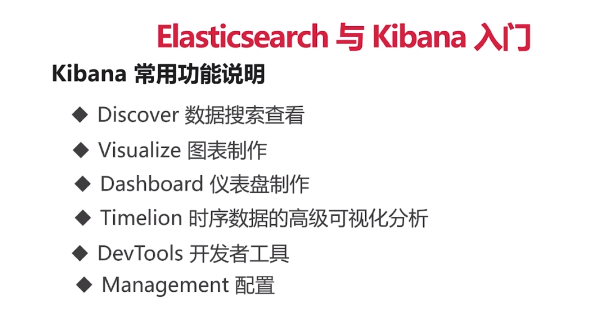
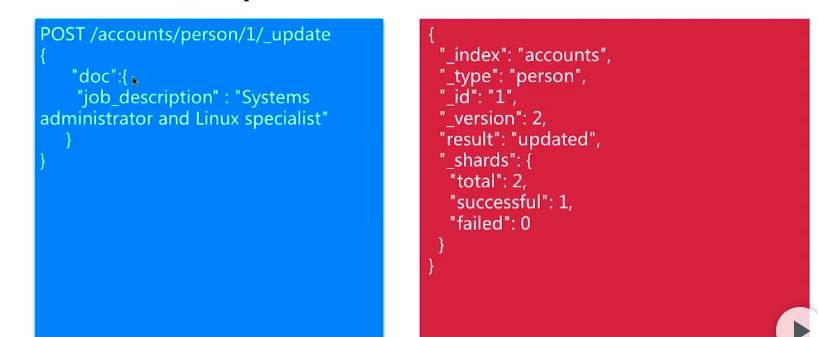
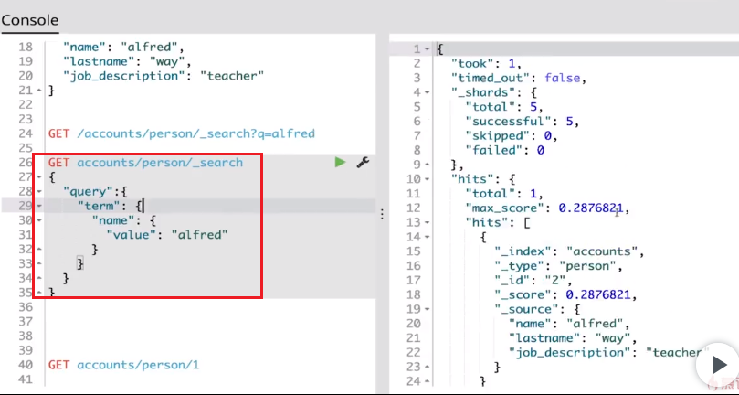

# ELK

## Kibana常用配置及功能




## ES的术语和CRUD


在Dev Tools中去执行

1. 创建


2.读


3. 更新



4. 删除


### ES 查询


#### Query String


#### Query DSL



```curl
#
GET _cluster/health

```


## BEATS


### Filebeat


filebeat 可以有多个prospectors,相当于多个监听器

##### filebeat的输入配置.


#### filebeat输出配置


