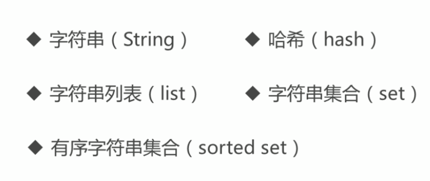
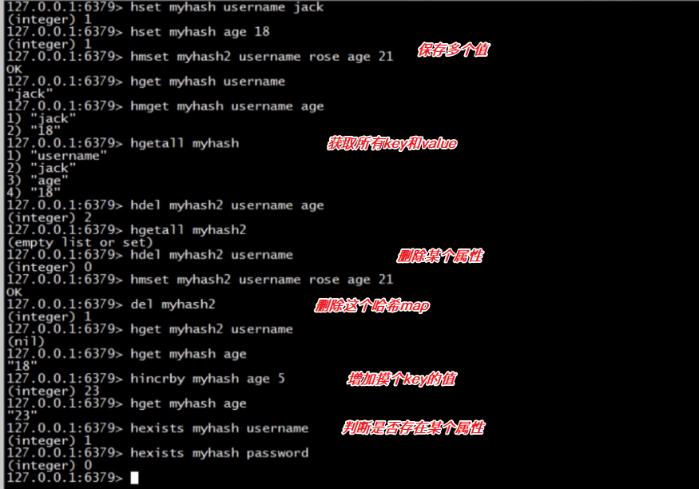
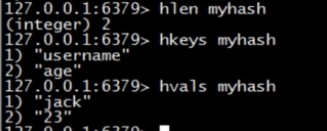
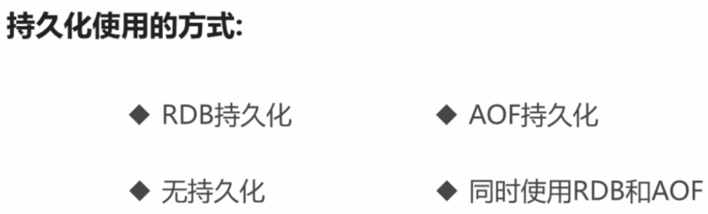

# REDIS

# 1.数据类型



### 1.1 键值对

常用命令

- set key value

- get key
- incr key(如果没有key，那么创建一个新的key，初始值为0，并加一)
- decr key
- decrby key step
- append key value(在key的之后拼接value，返回值的长度)

### 1.2 哈希：





### 1.3 list


### 1.4 Set

不可重复

- sadd key val1val2 val3 
- srem key val1 val2
- scard key(长度)
- sdiff key1 key2(key1-key2 差集)
- sdiffstore key key1 key2 （key1-key2的差集存储到key）
- sinter key1 key2 交集
- sinterstore key key1 key2 存储交集
- sunion key1 key2 并集
- sunionstore key key1 key2 并集存储
- smembers key 遍历
- sismember key val 判断某个值是否属于key中的值


### 1.5 SOrted-set

每个值都有一个对应的分数


### 1.6 keys通用操作

- keys *
- keys my?
- get key_name
- del key1 key2 key3...
- type key
- exists key
- expire key life_time(单位秒)
- ttl key(剩余存活时间，未设定返回-1)
- rename key_old_name key_new_name

## 2. redis特性

### 2.1 数据库

数据库

- 默认是0数据库
- 一个redis实例最多可选16个数据库（0-15）
- `select 1`来变更数据库
- `move myset 1`吧某个key移动到指定的数据库

### 2.2 事务

简介

multi（开启事务）

exec（提交事务）

discard（回滚事务）


## 3. 持久化



### 3.1 RDB

# windows下的redis
## 做成服务
在cmd中打开redis文件夹
```
redis-server.exe --service-install redis.windows.conf --service-name Redis6379 --port 6379
```
打开“服务”，查看当前是否建立服务，并启动服务，（设置为自动启动）
