---


---


# 安全

## OSI安全体系

> Open System Interconnection

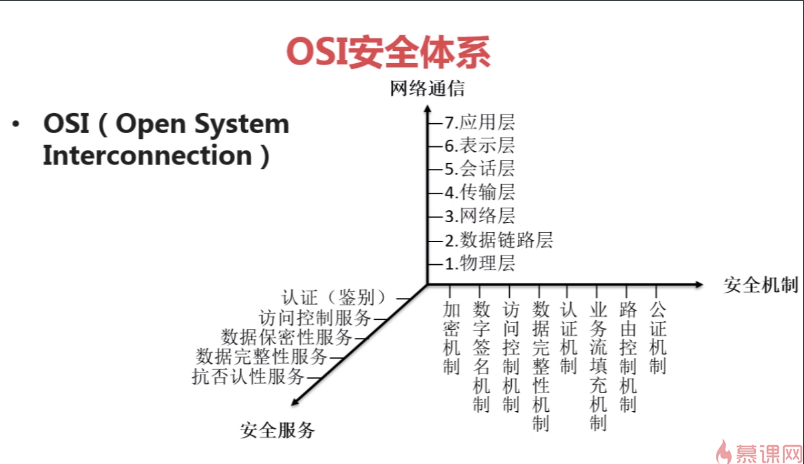

## TCP/IP安全体系

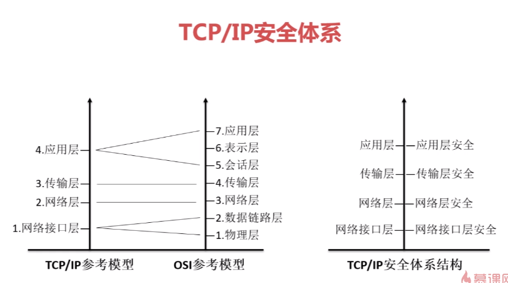

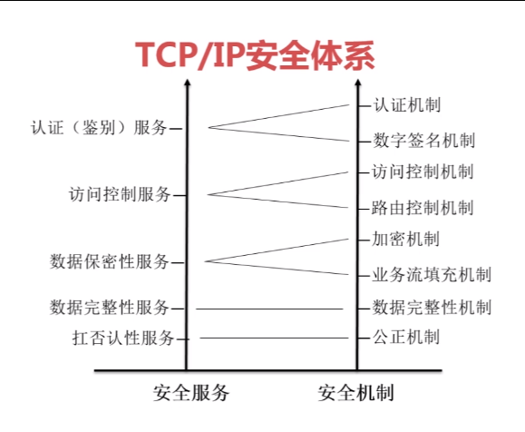

## java安全

### 安全组成

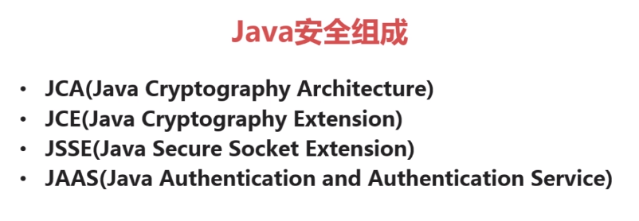


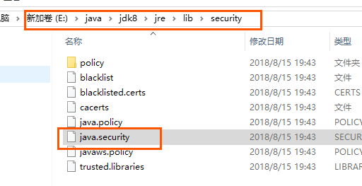

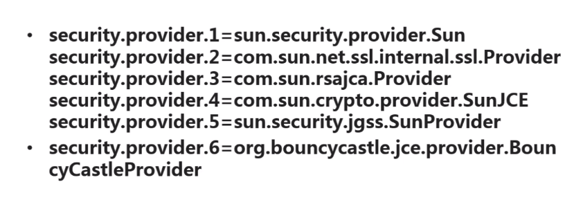

- 在文件中可以自己加,自行配置
- 在代码中定义

### 相关的包

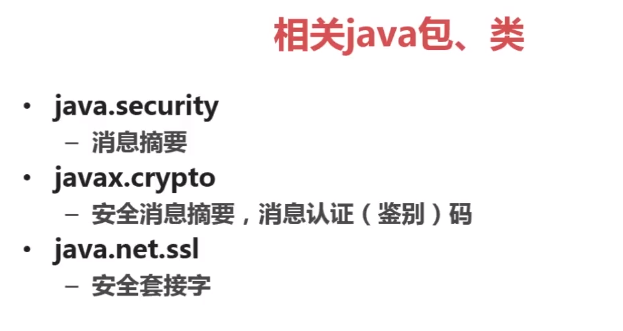

### 第三方扩展

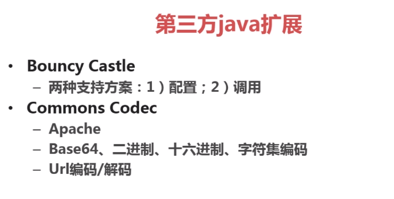

## base64

### 算法实现

- jdk
- Commons Codec
- Bouncy Castle

### 应用场景

- e-mail
- 密钥
- 证书文件

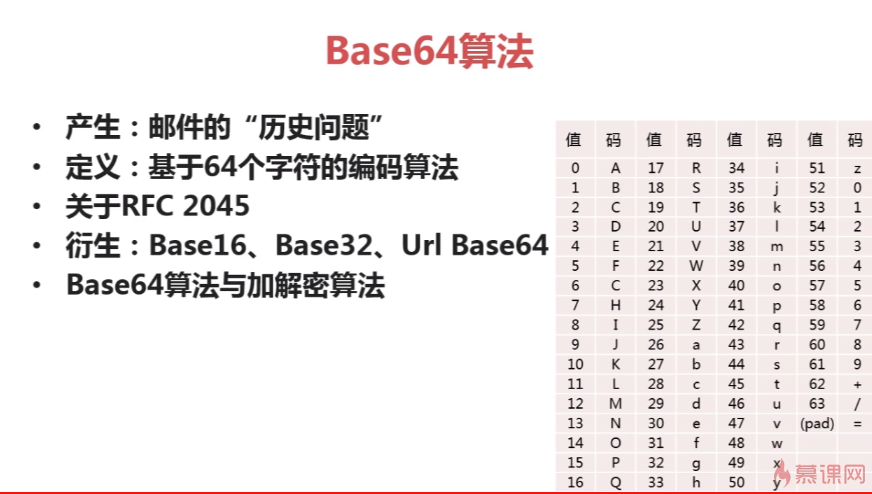

## 数字签名算法

- 数字签名--带有密钥(公钥,私钥)的消息摘要算法
- 验证数据完整性,认证数据来源,抗否认
- 私钥签名,公钥验证
- RSA,DSA,ECDSA

### RSA

MD,SHA两类

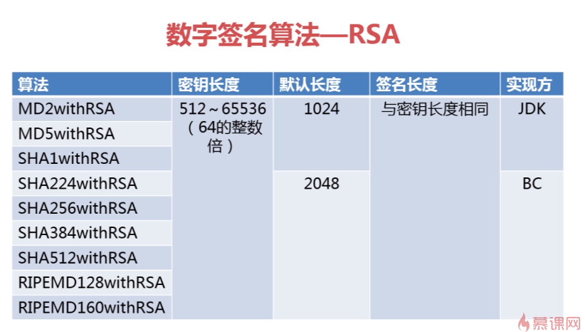


## 消息摘要算法

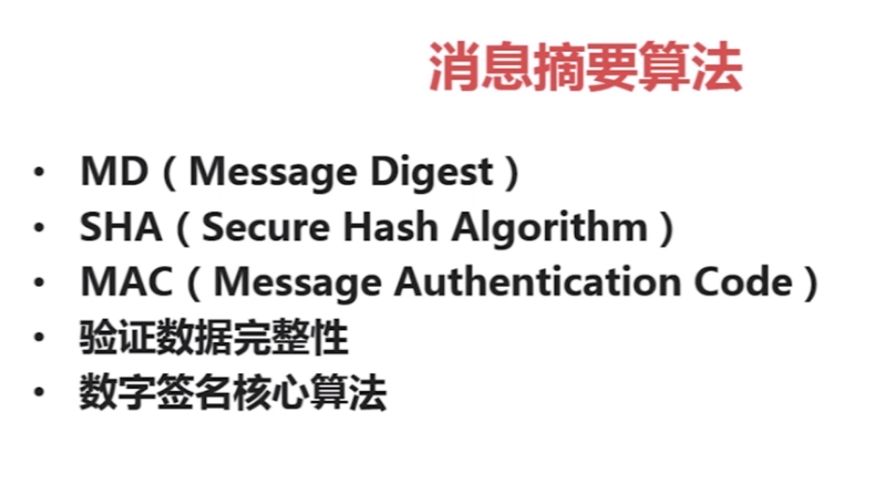

### MD5 
- MD5
- MD家族(128位摘要消息)
  - MD2,MD4

### 使用Security.addProvider()方法

```java
/**
 *测试jdk的md4
 *  jdk本身没有md4  可以添加一个提供者
 */
@Test
public void testJDKMD4(){
   try {
      Security.addProvider(new BouncyCastleProvider());
      MessageDigest md = MessageDigest.getInstance("MD4");
      byte[]md4Bytes=md.digest(src.getBytes());
      //转成16进制
      System.out.println("jdk md4: "+Hex.encodeHexString(md4Bytes));
   } catch (NoSuchAlgorithmException e) {
      e.printStackTrace();
   }
}
```

### md应用

先将密码保存到数据库

登陆的时候讲输入的密码md加密.如果两者相等,即登陆成功

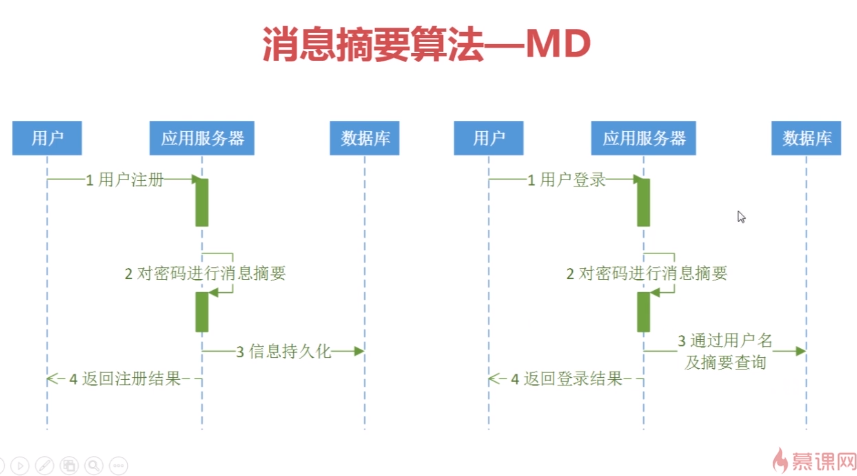

## SHA

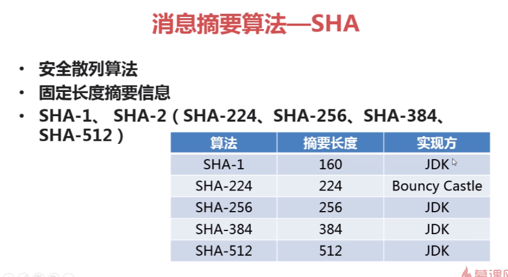

> 现在已经有人破解了md5,SHA-1算法

### SHA应用

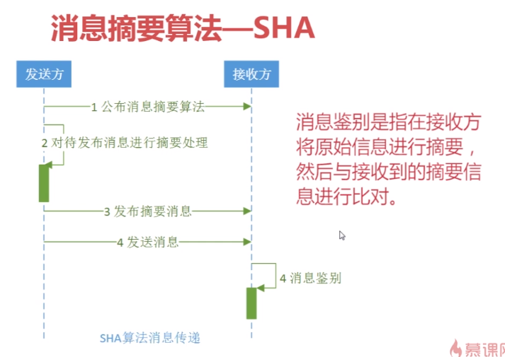

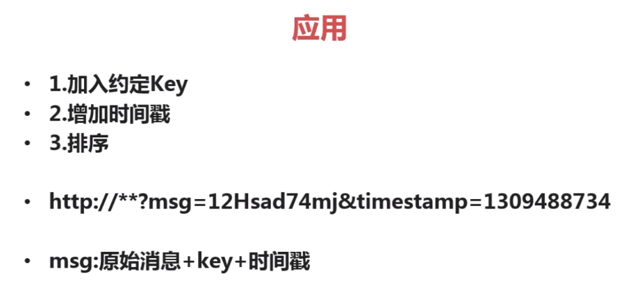

## MAC算法

两种名称

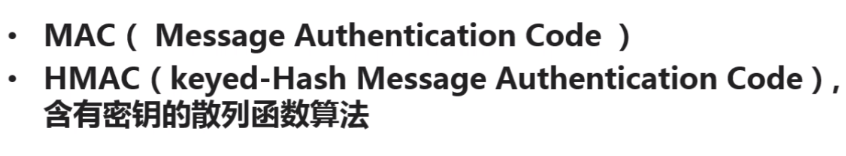

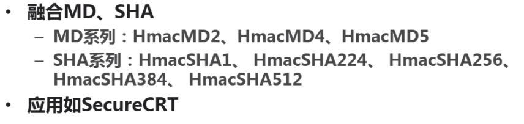

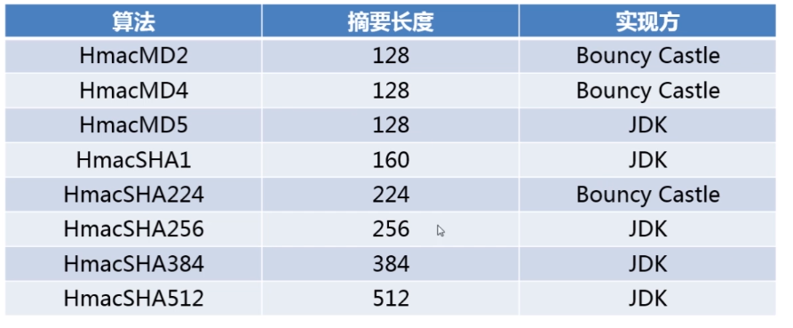

```java
private static final String SRC = "longer security mac";
@Test
public void testJdkMacMd5() throws NoSuchAlgorithmException, InvalidKeyException {
   //初始化keyGenerator
   KeyGenerator keyGenerator = KeyGenerator.getInstance("HmacMD5");
   //产生密钥
   SecretKey secretKey = keyGenerator.generateKey();
   //获得密钥
   byte[] key = secretKey.getEncoded();
   //还原密钥
   SecretKey restoreKey = new SecretKeySpec(key, "HmacMD5");
   //实例化Mac
   Mac mac = Mac.getInstance(restoreKey.getAlgorithm());
   //初始化Mac
   mac.init(restoreKey);
   //执行摘要
   byte[] macBytes = mac.doFinal(SRC.getBytes());
    //结果是
    //jdk macMd5: c7c7ca48813cb0cf3a2df42305c1a8e1
   System.out.println("jdk macMd5: "+ Hex.encodeHexString(macBytes));
}
```

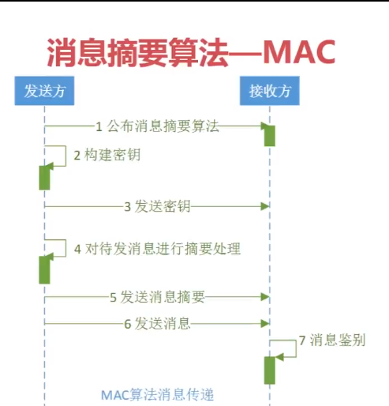

### 其他消息算法

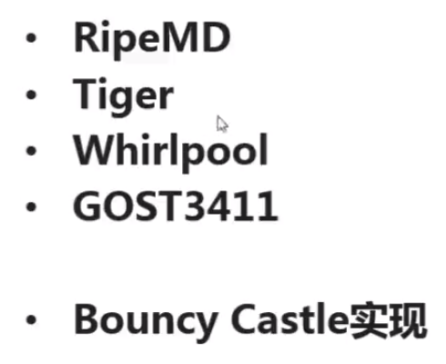

## 对称加密算法

DES--容易破解